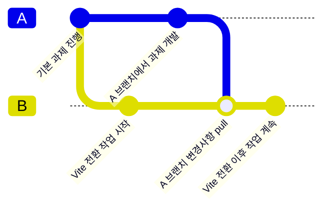

안녕하세요. My 구독은 톡클라우드 및 이모티콘 플러스와 같은 카카오톡 내 서비스를 정기구독하거나, 같이가치 플러스를 통해 정기 기부를 할 수 있도록 상품 정보부터 해지까지 전체 플로우를 제공하는 플랫폼입니다.

My 구독은 생긴지 5년 가까이 되는 플랫폼인데요. My 구독이 생겼던 2020년에는 Webpack과 React가 인기가 많았기 때문에 해당 스택을 기반으로 구성되었습니다. 초반에는 서버 작업 이전에 먼저 FE가 컴포넌트를 구성하는 상황이 많았기 때문에 Storybook도 함께 사용하고 있는 상황입니다.

5년이라는 시간이 지나면서, 그 사이에 React는 v16 버전에서 v19 버전으로, 그리고 Webpack은 v4.41 버전에서 v5.101 버전으로 메이저 업그레이드가 되었습니다. 이러한 상황 속에서, My 구독은 지속적으로 Dependency가 있는 패키지를 업데이트하고, 마이그레이션을 통해 서비스를 안정적으로 운영할 수 있도록 노력해왔습니다.

다만, 최근 React 19가 출시되면서, 기존에 My 구독에서 사용하는 React, Webpack, React Query, 그리고 Storybook까지 서로 Dependency가 생기면서 업데이트가 어렵게 되었습니다. 자연스럽게 ‘과연 빌드 도구를 계속 Webpack으로 가져가도 괜찮을까?’ 하는 고민이 생겼고, 이 과정을 단순히 개선으로 끝내기보다는 여러분들과 공유를 해보면 어떨까하여 이 글을 작성하게 되었습니다.

이번 글에서는 왜 빌드 도구를 바꾸게 되었는지, 어떤 기준으로 빌드 도구를 선택했는지, 그리고 전환 과정을 공유하겠습니다.

## Webpack, 지금 당장은 문제 없지만 앞으로도 괜찮을까?

사용하고 있는 Webpack은 충분히 좋은 도구라고 생각합니다. My 구독에서도 큰 문제 없이 안정적으로 동작하고 있습니다. 아마 앞으로 Webpack 업데이트가 중단되지 않는 한 많은 프로젝트에서 그대로 사용될 가능성이 높습니다. 그럼에도 불구하고, 최근 커뮤니티나 블로그에서는 Webpack에서 Vite로 전환하는 사례를 종종 볼 수 있었습니다.

누군가는 개발 서버(Dev Server)의 속도와 컴파일 속도가 빠르다는 이유로, 또 다른 누군가는 복잡한 설정에서 벗어나고 싶다는 이유로 전환을 선택하기도 합니다. 이유는 다양하지만, 공통적으로 ‘조금 더 편하고 빠른 개발 환경’을 찾는걸 목표로 합니다.

프로덕션(Production) 수준에서 서비스를 운영하는 입장에서는, 빌드 도구를 변경했을 때 예상하지 못한 부분에서 장애가 발생할 수 있는 리스크와 이를 개선하는 데 들어가는 시간 및 비용도 고려되어야 합니다. My 구독 프로젝트는 컴파일 속도가 대략 3\~4초 정도 소요되고, HMR(Hot Module Replacement)도 체감상 인지하기 어려울 정도로 빠르게 처리되는 느낌이 듭니다. 분 단위로 소요되는 것도 아니고, 신규 기능 도입으로 Webpack에서 해결하기 어려운 상황이 아닙니다.

```Webpack
Webpack 5.95.0 compiled successfully in 3107 ms
Webpack 5.95.0 compiled successfully in 2983 ms
Webpack 5.95.0 compiled successfully in 2944 ms
Webpack 5.95.0 compiled successfully in 2974 ms
```

### Webpack의 한계

5년이라는 시간 동안 프로젝트의 규모는 점차 커지고 기능도 많아졌습니다. 그 과정에서 안정성을 확보하기 위해 Storybook도 적용하고, 테스트를 위한 여러 서버 환경을 구성했으며, E2E와 Snapshot 테스트도 도입했습니다. 최근에는 Typescript 전환도 진행했습니다.

아래는 My 구독에서 사용하고 있는 Webpack 설정입니다. Webpack은 높은 자유도와 강력한 기능을 제공하지만, 결과적으로 설정 규모가 커지면서 설정 파일을 볼 때 한눈에 파악하기 어렵고, 각 플러그인과 설정이 어떤 기능을 하는지 다시 찾아보며 확인해야 하는 경우도 있었습니다.

* **Babel**: TypeScript 및 최신 JavaScript 트랜스파일
* **CSS 처리**: MiniCssExtractPlugin으로 CSS 코드 분리 및 추출
* **Asset 처리**: 이미지 및 폰트 등은 asset/resource와 asset/inline으로 처리
* **환경 변수 주입**: DefinePlugin으로 .env 값 주입
* **최적화**: TerserPlugin, CssMinimizerPlugin, splitChunks 설정을 통한 번들 최적화
* **스토리북**: Webpack 기반 설정 커스터마이징

### 앞으로의 빌드 도구 고민

틈틈히 설정을 재정리하고 개선해 나갔지만, Webpack은 자주 수정되는 항목들은 아니어서, 수정할 때마다 놓치는 부분이 발생하곤 했습니다. 그로 인해 피로도가 쌓이면서, 과거에는 다양한 옵션과 높은 확장성을 제공하는 것이 장점으로 여겨졌던 Webpack이 점차 단점으로 느껴지는 시점이 되었고, 전체적인 검토가 필요하다는 의견이 모였습니다.

이러한 경험을 통해, 지금은 Webpack으로 충분히 잘 운영하고 있지만, 앞으로도 계속 유지할 것인지, 아니면 더 단순하고 빠른 도구로 전환할 것인지에 대한 고민이 필요하다는 점을 자연스럽게 깨닫게 되었습니다.

## 다른 빌드 도구라면 해답이 될까?

사실 Webpack 설정 자체를 개선해서 복잡도를 낮추는 방법도 있습니다. 하지만 개발자는 늘 새로운 것을 시도하며 더 나은 해법을 탐구해야 한다고 생각했습니다. 단순히 ‘해답’을 찾는 것보다, 더 나은 방향을 찾아 나서는 과정에 도전을 해보고 싶었던 것이죠.

그리고 저희에게는 다음 과제도 이어나가야 했기 때문에 많은 시간이 주어진 것도 아니었습니다. 그래서 바로 실 적용을 하기 보다는, 빌드 도구들을 먼저 리서치했습니다. 소크라테스의 ‘너 자신을 알라’라는 격언처럼, 우리가 사용하는 기능과 반드시 필요한 기능이 무엇인지 정리하는 과정부터 시작했습니다. 이 과정을 통해 기준을 세우고, 이를 바탕으로 대안을 탐색했습니다.

### 빌드 도구 후보군 선정 기준

여러 빌드 도구들을 비교하기에 앞서, 어떤 도구들을 후보군에 포함할지 우선 정의했습니다.

저희는 React를 주요 프레임워크로 사용하고 있어서 React 공식 문서에서 추천하는 빌드 도구들을 우선 검토 대상으로 삼았습니다. 이 과정에서 3가지 빌드 도구를 선정했습니다:

* **Vite**: 브라우저 ESM 기반으로 빠른 개발 서버와 컴파일 속도를 제공하는 도구
* **Parcel**: 설정 없는 개발 경험(Zero-config)을 지향하는 올인원 도구
* **Rsbuild**: Rust 기반 Rspack을 엔진으로 하여 Webpack과 높은 호환성을 제공하는 도구

### 빌드 도구 전환시 고려한 항목들

저희 프로젝트에 적합한 빌드 도구를 선택을 하기 위해 다음 항목들을 우선순위에 따라 고려했습니다.

1. 설정 복잡도
   * 초기 설정이 단순하고, 기본값만으로도 프로젝트를 잘 운영할 수 있는지
   * 복잡한 커스텀 설정이 필요한 경우에도 문서와 예제가 충분히 마련되어 있는지
2. 호환성
   * 현재 Webpack 환경에서 사용되고 있는 플러그인이나 기능들이 동일하게 제공되는지
   * 직접적인 대체 기능이 없을 경우, 유사 기능을 제공하는 플러그인이 있거나 커스터마이징이 가능한지
3. 생태계
   * 커뮤니티가 활발하고, 지원이 잘 되는지
   * 다양한 플러그인 및 관련 자료가 풍부하게 제공되는지
4. 성능
   * 초기 컴파일 속도와 HMR(Hot Module Replacement) 속도가 빠른지
   * 번들 사이즈를 얼마나 줄일 수 있는지

성능은 중요하지만, 최신 빌드 도구들은 이미 일정 수준 이상의 속도를 제공하고 있고, 저희 프로젝트에서도 초기 컴파일 속도가 약 3초 정도로 충분히 빠르다고 판단했습니다. 따라서, 설정 복잡도, 호환성, 생태계가 더 핵심적인 기준이 되었습니다.

## 본격적으로 빌드 도구 비교해 볼까?

다음은 위에서 언급한 항목들을 기준으로 빌드 도구들을 비교해보고 정리한 표입니다.

|        | Vite                                           | Parcel                               | Rsbuild                              |
|:-------|:-----------------------------------------------|:-------------------------------------|:-------------------------------------|
| 설정 복잡도 | 기본 설정이 단순하고 직관적, vite.config.js를 통해 커스터마이징도 용이 | Zero-config에 가까움, 복잡한 설정 제어는 어려움     | Webpack 호환성 유지, Zero-config 지향       |
| 호환성    | ESM 기반, 다양한 플러그인 지원, React 19 등 최신 스택 대응       | 기본 내장 기능이 많음 (번들링, 이미지 최적화, 코드 분할 등) | 기존 Webpack 에코시스템 활용 가능               |
| 생태계    | 생태계 큼 (활발)                                     | 제어 어려움, 플러그인 부족                      | 생태계 미성숙, 문서 부족                       |
| 성능     | 빠른 빌드 속도, HMR, ESBuild 사용                      | 빠르지만 대규모 프로젝트에서 상대적으로 한계 존재          | Webpack 대비 5\~10배 빠른 빌드 속도 (Rust 기반) |

### 설정 복잡도

Vite는 기본 설정이 Webpack에 비해 직관적이며 설정 파일인 vite.config.js도 간단한 구조로 되어 있어 커스터마이징이 용이합니다. [Parcel](https://parceljs.org/#zero-config)과 [Rsbuild](https://v0.rsbuild.dev/guide/start/#-features)는 거의 설정 없이 즉시 사용 가능한 Zero-config 방식으로 거의 필요한 모든 플러그인을 자동으로 설치합니다. 다만 Parcel은 복잡한 커스터마이징에 있어 제한적일 수 있습니다. 또한 Rsbuild는 Webpack을 기반으로 설정 방식이 설계되었기 때문에 [Webpack에서 마이그레이션](https://rspack.rs/guide/migration/webpack#migrate-from-webpack)을 용이하게 할 수 있고, Webpack 경험자에게 익숙한 방식을 제공하고 있었습니다.

### 호환성

다음으로는 호환성을 비교해보았습니다.

Vite는 ESM(ECMAScript Modules) 기반으로 개발되었으며 Rollup 기반으로 최종 번들링을 지원합니다. 뿐만 아니라 다양한 프레임워크(React, Vue 등)와 플러그인을 공식 및 서드파티로 지원합니다. 마찬가지로 [Rsbuild](https://rsbuild.rs/config/plugins#rspack-plugins)는 위에서 언급했듯이 Webpack API와 플러그인 호환성이 강점으로, 기존 플러그인 활용이 가능했습니다. [Parcel](https://parceljs.org/features/plugins/#plugins)의 경우, 이미지 최적화, 코드 스플리팅 등 다양한 기능이 기본적으로 내장되어 있는 도구이지만 Webpack 수준의 복잡한 기능이나 플러그인 호환성은 부족해보였습니다.

### 생태계

각 빌드 도구의 생태계가 어떤지 파악하기 위해 [npm-stat](https://npm-stat.com/charts.html?package=vite&package=webpack&package=parcel&package=%40rsbuild%2Fcore&from=2024-09-04&to=2025-09-04)에서 2025년 9월 4일 기준으로 NPM 다운로드 수, Release Cycle, GitHub Stars 등을 확인해보았습니다.

|                        | Webpack               | Vite                                   | Parcel            | Rsbuild    |
|:-----------------------|:----------------------|:---------------------------------------|:------------------|:-----------|
| npm 다운로드 수 (1년)        | 1,498,682,292         | 1,510,234,757                          | 11,604,551        | 11,315,407 |
| GitHub Stars           | 65.5k                 | 75.1k                                  | 43.9k             | 2.9k       |
| Release Cycle (릴리즈 주기) | 버그 수정/개선 시 빠르게 릴리즈 진행 | 매주 Patch, 2달에 한 번 Minor, 1년에 한 번 Major | 2주 \~ 1달에 한 번 릴리즈 | 매주 Patch   |

지난 1년간의 다운로드 수를 살펴보면, Vite는 Webpack과 비슷한 수준의 다운로드 수를 지니고 있으며, 심지어 올해 7월에는 처음으로 Vite가 Webpack의 npm 다운로드 수를 넘어서기도 했습니다.


반면, Parcel과 Rsbuild는 Webpack과 Vite의 다운로드 수에 비해 1%도 못미치는 수준으로, 생태계 규모가 작았습니다.

각 빌드 도구의 GitHub도 확인해 보았는데요. GitHub Stars로 살펴보니 Vite는 무려 75.1k의 Star 갯수를 지니고 있어 가장 많은 주목을 받고 있으며, Webpack보다 약 10k의 Star 갯수가 많았습니다. 그에 비해 Rsbuild의 Star 수는 2.9k로 상대적으로 적었습니다.

또한 릴리즈 주기도 파악해보았습니다. Vite는 Patch를 매주, Minor는 2달에 한 번, Major는 매년 진행하는 [공식적인 Release Cycle](https://vite.dev/releases.html)이 존재했습니다. 반면 Webpack, Parcel, Rsbuild는 정해진 릴리즈 주기는 없지만 모두 활발하게 배포되고 있습니다.

Webpack은 버그 수정이나 개선 사항이 생기면 빠르게 릴리즈 패치 진행하는 것으로 보였으며, Parcel 역시 공식적인 일정은 없지만 최근 몇 달 동안은 2주내지 한달 내외 수준으로 릴리즈가 이루어지고 있습니다. 마지막으로 Rsbuild는 보통 매주 패치를 진행한다고 [공식 문서](https://rsbuild.rs/community/releases/#release-cycle)에 명시되어 있습니다.

정리하자면, Vite는 다운로드 수 및 GitHub Star 갯수가 Webpack을 넘어설 만큼 빠르게 성장 중인 생태계를 가지고 있으며, 다양한 플러그인과 관련 도구도 활발하게 개발되고 있습니다. 반면 Parcel는 생태계가 성장하는 것으로 보이나 Vite (80k Stars)나 Webpack에 비해 상대적으로 작은 규모입니다.

이와 더불어 Rsbuild의 생태계 규모도 상대적으로 작아 보였습니다. GitHub Star 개수, [StackOverflow](https://stackoverflow.com/search?tab=Relevance&pagesize=50&q=rsbuild&searchOn=3&s=7c62f69e-3aac-4c90-a8fe-714a60ac06dc)에서의 질문 개수도 2025년 9월 기준, 50개 미만일 정도로 도움이 필요할 때 지원받기에는 부족하고 실서비스에는 적용하기 어렵다고 느껴졌습니다.

### 성능

마지막으로 각 빌드 도구의 성능을 살펴보았습니다.

Rsbuild(RsPack)에서 빌드 도구 성능을 측정한 [결과](https://github.com/rspack-contrib/build-tools-performance?tab=readme-ov-file#results)에 따르면, 1000개의 컴포넌트 및 node_modules에 약 1,500개의 모듈을 가진 리액트 앱을 기준으로, Rsbuild가 Dev Cold Start, HMR, Prod Build 모두 가장 빠른 성능을 지니고 있습니다.

| Name             | Dev Cold Start | HMR   | Prod Build | Total Size | Gzipped Size |
|:-----------------|:---------------|:------|:-----------|:-----------|:-------------|
| Rsbuild v1.5.0   | 616ms          | 100ms | 565ms      | 870.8kB    | 212.5kB      |
| Vite v7.1.3      | 4615ms         | 141ms | 2354ms     | 799.0kB    | 215.8kB      |
| Webpack v5.101.3 | 3356ms         | 308ms | 2676ms     | 836.2kB    | 223.4kB      |
| Parcel v2.15.4   | 2947ms         | 147ms | 3435ms     | 954.8kB    | 228.1kB      |

Rsbuild는 Rspack 기반의 Rust 아키텍처 덕분에 실질적으로 Webpack 대비 5\~10배 빠른 빌드 성능을 제공하고 있습니다.

Vite의 경우, HMR 속도가 Webpack보다 2배가량 빠릅니다. Dev Cold Start 측면에서는 Webpack보다 느린것으로 보였지만, 프로젝트의 규모가 커지면 커질수록 Vite가 Webpack보다 빨라지는 것을 알 수 있었습니다. 또한 Vite의 개발 서버는 ESM + esbuild 기반으로 매우 빠른 HMR을 제공하며, 일반적인 자바스크립트 빌드 도구보다 10 \~100배 더 빠르다는 [벤치마크](https://ko.vite.dev/guide/why.html#slow-updates)도 있습니다.

반면 Parcel은 HMR 속도나 Dev Cold Start 모두 Webpack보다는 빨랐지만, 프로젝트 규모가 커지면 커질수록 HMR을 제외한 모든 측면에서 Webpack보다 느려 대규모 프로젝트에서는 성능 저하와 한계가 있는 것을 확인했습니다.

## 우리는 왜 Vite에 주목했을까?

지금까지 여러 빌드 도구를 알아보고 고려되어야 할 항목도 살펴보았습니다.

시간적인 여유도 부족했고 다양한 빌드 도구를 적용해보고 테스트를 해볼 수 있었으면 좋았겠지만, 아쉽게도 그럴 여유는 없는 상황이라 내부적으로 검토한 결과 Vite가 최종 결정되었습니다.

이번에는 고려해야 할 항목들을 다시 살펴보면서 Vite를 선택하게 된 이유도 함께 공유해 드리겠습니다.

### 설정의 복잡도

과거 독점에 가까웠던 Webpack을 넘어서기 위해 만들어진 도구들답게, 설정은 최소화하거나 심지어 설정 없는 개발 경험(Zero-config)을 지향하는 경우도 있습니다.

Parcel의 Zero-config는 매력적인 요소 중 하나였지만, 프로젝트 구성이 다소 복잡하기에 설정 자체를 자동화하는 것은 리스크가 높다고 판단하였습니다.

그 결과, Webpack과 Zero-config의 중간 지점에 있는 Vite에게 더 높은 점수를 주게 되었습니다.

### 호환성

마찬가지로, Webpack의 경쟁 상대로 나온 도구들이다 보니, 커스텀 플러그인을 제외한 Webpack 자체에서 지원하는 기능 대부분을 제공합니다. 이에 따라 이전에 검토했던 도구 모두 전환 자체에는 큰 문제가 없다고 판단했습니다.

프로젝트 자체만 봤을 때에는 분별력이 부족하여, 보조 도구인 Storybook까지 포함하여 검토하기로 논의했습니다.

사용 중인 Storybook은 v8 버전이며, Vite와 Webpack 빌더만 공식적으로 지원합니다. 물론 프로젝트의 빌드 도구와 Storybook의 빌더는 다르게 구성해도 문제가 없지만, 이는 설정의 복잡성과 연계되므로 최대한 휴먼 에러를 줄이고 불필요하게 환경을 이중으로 구성하는 것을 피하기 위해 Vite에게 더 높은 점수를 주게 되었습니다.

### 생태계

실(프로덕션) 서비스이다 보니, 사용하는 도구가 앞으로도 지속적으로 업데이트될 것이라는 기대가 필요합니다.

이미 소개해 드렸듯이, 이를 확인해 볼 수 있는 지표는 활발한 커뮤니티와 릴리즈 주기, 그리고 GitHub Stars 개수와 같은 정량적인 정보입니다. 이러한 지표들을 주의 깊게 살펴봐야 합니다.

그 이유는 문제가 생겼을 때, 정보가 많아 대응이 비교적 쉬워지고, 취약점 측면에서도 빠른 대응을 기대할 수 있기 때문입니다. 또한 앞으로의 도구의 개선 여부를 판단하는 중요한 지표가 될 수 있습니다.

그 외에 시대의 흐름도 살펴볼 필요가 있습니다.

25년 5월부터 7월까지의 다운로드 수를 분석한 결과, 주말에는 Vite가 미세하게 높은 다운로드 수를 기록하고, 평일에는 Webpack이 좀 더 높은 다운로드 수를 기록하고 있다는 것을 알 수 있었습니다. 이를 바탕으로 개인 프로젝트에는 Vite를 더 많이 사용하고, 회사에서는 아직까지 Webpack을 좀 더 사용하고 있다고 볼 수 있습니다.

요즘 Claude Code와 같은 AI 도구로 프로젝트를 많이 생성하는데, 체감상으로 프로젝트 환경 구성에서 Webpack을 추천하는 경우는 거의 없었고 Vite로 시작하는 경우가 많았습니다. 시대의 흐름에 따라 바이브 코딩이 점차 확산되고 1인 개발이 늘어나면서 앞으로 좀 더 Vite를 사용하는 사례가 많아질 것으로 예상됩니다.

소개해 드린 이러한 내용들을 검토한 결과 Webpack을 제외하고는 Vite가 가장 큰 커뮤니티를 가지고 있는 것으로 보였기에 높은 점수를 주게 되었습니다.

### 성능

처음 이야기 드린 것처럼, 성능 측면에서 큰 불편함은 없었습니다.

각 도구들 나름대로의 최적의 성능을 제공한다고 소개하고 있고, 현재 사용하는 Webpack보다는 좋다고 설명하고 있습니다. 따라서 Webpack을 고려 대상에서 제외하는 근거가 되었고, 성능 측면에서만 본다면 RsBuild에게 높은 점수를 주게 되었습니다.

### 결과

호환성부터 성능까지 다양한 요소를 검토하고 나름대로의 우선순위를 정한 결과, 최종적으로 Vite로 결정하게 되었습니다.

## Vite로의 전환, 어떻게 준비하고 진행했을까?

Vite로 전환하기로 결정한 후, 저희는 먼저 안정성을 검토했습니다. 실 서비스에서 무작정 빌드 도구를 바꾸는 것은 위험하기 때문입니다. 또한 신규 과제를 진행 중이었기 때문에, 실제 코드와 충돌 가능성을 최소화하는 방식으로 접근했습니다.

다행히 이번 전환은 빌더 수준의 변경이었기 때문에, 코드 베이스 자체가 수정되는 경우는 환경변수 관련 부분 정도로 제한될 것으로 판단했습니다. 즉, 코드 충돌 위험이 낮았고, 실험해볼 수 있는 환경이었습니다.

그래서 저희는 안전하게 시도하되, 나쁘면 적용하지 않기로 하였습니다. 빌드 도구 전환을 시도했다는 것 자체만으로도 도전이었고, 좋으면 좋은대로, 나쁘면 나쁜대로 저희의 경험과 결과를 기록하는 것이 더 큰 가치라고 판단했습니다.

### 준비 단계: 마이그레이션 작업 리스트 생성

우선 여러 후보군을 비교하여 Vite로 전환하기로 결정 후, 사전에 Webpack에서 사용하고 있는 기능 및 플러그인들을 Vite에서는 어떻게 적용할지 리서치하고 검토했습니다. 그 후, 작업을 세분화하여 작업 리스트를 만들었습니다. 이를 통해 진행 상황을 명확히 하고 역할을 조율할 수 있었습니다.

저희가 만들었던 작업 리스트는 다음과 같습니다:

1. **Vite 설치 및 기본 설정**
   * vite.config.ts 생성
   * 기본 Entry point 설정
   * TypeScript 설정
2. **환경변수 정리**
   * DefinePlugin 기반 process.env → import.meta.env 변경
   * 환경(Phase)별 env 파일 분리
   * 외부 Config 주입 방식 점검
3. **CSS 처리 마이그레이션**
   * MiniCssExtractPlugin 제거
   * Vite 내장 CSS로 전환, SourceMap 확인
4. **Dev Server/HMR 설정**
5. **Babel 제거 및 SWC/ESBuild 전환**
   * babel-loader 제거
   * Vite 기본 트랜스파일러 사용
6. **코드 스플리팅 및 최적화 옵션 마이그레이션**
   * 기존 splitChunks, runtimeChunk, terserOptions, cssMinimizerOptions → Vite 기본 옵션 사용, build.rollupOptions로 재구성
7. **소스맵 설정 및 Sentry 연동**
   * Webpack에서만 지원되는 사내 Sentry 플러그인 제거 및 cli로 변경
8. **Storybook Vite 빌드 전환**
9. **Docker 설정 업데이트**
10. **기능 및 성능 테스트**
    * 초기 컴파일 속도
    * HMR 시간
    * 번들 크기 분석

### 브랜치 전략

먼저, Vite로 전환 후 기능과 성능을 테스트 하려면 동일한 코드를 기반이 필요했습니다.

저희는 과제를 진행 중이었기에, 영향을 최소화하고자 하였습니다. 그래서 과제 진행 중인 브랜치를 A 브랜치(base)로 두고, Vite 전환을 작업할 신규 브랜치로 B 브랜치를 생성하였습니다. 이후, A 브랜치에서는 신규 과제에 대한 내용을 작업하였고, 틈이 날 때나 Vite로 전환하는 작업을 진행할 때는 B 브랜치에 A 브랜치를 pull을 받아 수정하였습니다.



### 마이그레이션 진행 방식

브랜치 세팅 후, 마이그레이션 과정은 공통 작업과 개별 작업으로 나누어 진행했습니다.

#### 공통 작업

위 작업 리스트에서 1\~6번까지의 항목은 주로 Vite의 기본 환경 설정을 진행하고, 대부분 vite.config.js 파일에서 공통적으로 수정되어야 했기 때문에 2명이 나뉘어 작업한다면 파일 충돌이 우려되었습니다. 함께 진행하는 프로젝트인만큼, 공통으로 수정되어야 하는 핵심 항목들은 페어프로그래밍을 통해 작업하기로 결정하였습니다. 또한, Dev Server 실행이 되는 수준까지 작업을 해둔다면, 그 이후는 각자 필요한 부분을 수정해서 빠르게 전환할 수 있을 것이라고 판단했습니다.

그래서 우선 페어프로그래밍을 진행하며 수행했던 주요 작업은 다음과 같습니다:

1. CLI를 통해 Vite를 설치하였습니다.
2. vite.config.js 파일을 새로 추가하고 root, plugins 등의 기본 설정을 작업하였습니다.
3. 환경 변수 설정을 이관하였습니다.
   * 환경(Phase)별 env 파일로 분리하였습니다.
   * DefinePlugin 기반 process.env 방식을 import.meta.env로 수정하였습니다.
4. Alias 설정을 추가하였습니다.

#### 개별 작업

공통으로 수정되어야 할 부분을 페어프로그래밍 완료 후, 각자 작업을 나누어 진행했습니다.

한 명은…

* 빌드 및 rollupOptions를 수정하고, 기존에 빌드 스크립트에서 사용하던 Webpack API를 Vite로 변경하였습니다.
* 사내에서 소스맵 업로드시 사용되던 Webpack 전용 Sentry 플러그인을 제거하고, CLI를 통해 소스맵을 업로드하도록 변경하였습니다.

다른 한 명은…

* Storybook에서 사용하던 Webpack v5를 Vite v6로 이전하였고, Storybook + Webpack과 관련된 패키지들을 제거하였습니다.
* Webpack 기반이었던 Docker 설정을 Vite에서도 동작하도록 수정하였습니다.
* Webpack/babel/jest 설정을 제거하고 불필요한 패키지를 제거하며 프로젝트를 정리하였습니다.

**총 소요시간**: 약 2주 (실제 작업 시간은 약 3일, 나머지는 리서치 및 테스트)

이렇게 필요한 항목들을 하나하나 적용하며 빌드 전환을 마무리하였습니다.

공통 환경 설정은 페어 프로그래밍으로 진행하여 충돌 가능성을 최소화했고, 이후 개별 작업을 나눠서 수행함으로써 효율성을 높일 수 있었습니다.

덕분에 초기 컴파일 속도, HMR, 번들 크기 등 핵심 성능 지표를 안정적으로 확인할 수 있었고, 실험 과정에서 발생한 문제들도 빠르게 대응할 수 있었습니다.

## 전환을 마친 지금, 무엇을 얻었을까?

### 간편해진 설정

기존에는 여러 개의 복잡한 파일로 나뉘어 있어 관리할 부분이 많았습니다. 하지만 Vite는 대부분의 로더를 내부적으로 처리하므로 CSS, Assets, 환경 변수 주입, 최적화 등을 특별히 신경 쓸 필요가 없어졌습니다. 또한, .env 파일을 활용해 환경 변수를 효율적으로 관리할 수 있게 되었습니다.

무엇보다 환경 변수가 바뀌어도 HMR이 동작하기 때문에 개발 서버를 껐다 켤 필요가 없어졌습니다.

Storybook 환경설정 연동 역시 특별한 설정 없이 거의 그대로 사용할 수 있었던 점도 큰 이점입니다.

그 결과, 기존에 Webpack용 설정 파일 4개, babel 설정 파일 1개, Storybook 연동 설정 파일 1개까지 총 6개의 파일을 관리해야 했지만, 이제는 단 2개로 통합할 수 있었습니다. Jest에서 Vitest로 전환하면서 Vitest 설정을 Vite 설정으로 이전할 수도 있지만, 설정의 복잡도를 고려해 별도로 관리하여 테스트 설정 측면에서는 큰 변화가 없었습니다.

**As-Is:**

```bash
.
├── src
  ...
├── README.md
├── .babelrc
├── jest.config.js
├── webpack.config.docker-preview.js
├── webpack.config.docker.js
├── webpack.config.js
└── webpack.config.preview.js
```

**To-Be:**

```bash
.
├── src
  ...
├── README.md
├── env
├── vite.config.js
├── vite.config.storybook.js
└── vitest.config.js
```

### 빨라진 컴파일/HMR

My 구독의 초기 컴파일 시간은 평균 3,000ms 정도로 길지는 않았지만, Vite를 적용한 후에는 첫 컴파일에만 약 300ms가 소요되고 그 이후에는 100ms 이하로 결과를 얻을 수 있었습니다.

**As-Is: 평균 3,012ms**

```bash
Webpack 5.95.0 compiled successfully in 3055 ms
Webpack 5.95.0 compiled successfully in 3107 ms
Webpack 5.95.0 compiled successfully in 2983 ms
Webpack 5.95.0 compiled successfully in 2944 ms
Webpack 5.95.0 compiled successfully in 2974 ms
```

**To-Be: 평균 129ms**

```bash
VITE v6.3.5  ready in 342 ms
VITE v6.3.5  ready in 82 ms
VITE v6.3.5  ready in 82 ms
VITE v6.3.5  ready in 69 ms
VITE v6.3.5  ready in 69 ms
```

이전에 말씀드린 것처럼 별도 브랜치에서 작업하다 보니 Webpack과 Vite를 바꿔가면서 작업하는 경우가 많았고, 처음에는 큰 고려 사항이 아니라고 생각했던 부분이 역체감으로 느껴졌습니다. 결과적으로 30배 가까이 차이가 났기에, 이 정도 규모의 프로젝트에서도 개발 경험(Developer Experience, DX)을 충분히 개선할 수 있겠다는 확신이 들었습니다.

이 결과만 놓고 보면 공식 문서에서 언급하는 `10 ~ 100배 수준의 빠른 속도`가 어느 정도 맞는 것 같습니다.

### 까다롭게 바뀐 것들

도구를 교체하는 데 장점만 있는 것은 아닙니다.

그동안 편하고 유연하게 사용하던 기능들이 다소 강한 규칙 적용이나 새로운 규칙 때문에 번거로운 작업을 해야 할 때도 있었습니다. 이번 전환 작업에서는 다음과 같은 문제점들이 존재했습니다.

* **환경 변수 처리 변경** : `process.env` 대신 `import.meta.env`를 사용해야 하므로 기존 코드 베이스를 수정해야 했습니다.
* **빌드 설정 리서치 부담 증가**: 빌드 관련 내용을 찾아볼 때 Vite와 Rollup 문서를 모두 참고해야 하므로, Webpack 문서 하나만 보면 되었던 것보다 리서치에 드는 노력이 커졌습니다.
* **사내 플러그인 미지원**: 사내에서 제공하는 도구가 Webpack만 지원하여 Vite에서도 동작하도록 별도 작업을 해야 하는 상황이 발생했습니다.
* **JSX 문법 사용시, 파일 확장자 명시** : 기존 Webpack(babel)에서는 `.js`로 하더라도 JSX 문법을 자동으로 처리해 주었지만, 이제는 `.jsx`또는 `.tsx`로 명시해야 합니다. 그렇지 않으면 에러가 발생합니다.
* **Storybook의 Vite 지원 한계**: Vite의 설정 옵션인 mode를 기반으로 환경변수를 분기 처리하는 기능을 Storybook 자체에서 지원하지 않아, 결국 별도의 환경 설정 파일을 재구성해야 했습니다.

## 결론

빌드 도구는 끊임없이 진화하고 있으며, 언젠가 또 다른 기술을 고민해야 할 순간이 올 수 있습니다. 심지어 다시 Webpack으로 돌아갈 수도 있죠. 하지만 이번 Vite 전환을 통해 우리가 얻은 것은 단순한 도구의 교체 이상의 의미를 지닙니다.

처음에는 Webpack의 복잡한 설정을 간소화하는 데만 초점을 두었지만, 전환 과정을 거치며 프로젝트의 규모와 서비스의 특성을 깊이 고민할 수 있었습니다. 이 과정에서 우리는 기술 부채를 해소하고, 개발 환경을 훨씬 깔끔하게 정리했습니다. 실제로 컴파일 속도 개선을 체감하며 개발 경험(DX)이 크게 향상되었죠. 복잡했던 6개의 설정 파일을 단 2개로 줄었고, 초기 컴파일 시간은 무려 30배 가까이 단축되었습니다.

이러한 경험은 동기 부여가 점점 희미해지는 상황에서도 큰 역할을 할 수 있습니다. 빌드 도구와 같은 ‘설정 파일’도 코드의 영역이라는 인식하에, 기술이 늙어가는 것을 주기적으로 점검하는 태도가 중요하다는 것을 배웠습니다. 새로운 기술을 리서치하고, 기존 설정의 적절성을 재검토하는 과정은 개발자로서의 성장을 이끄는 발판이 될 것입니다.

결국 중요한 것은 `현재 상황에서 우리 팀과 프로젝트에 가장 잘 맞는 도구가 무엇인가?`라는 질문을 던지고, 그 답을 찾아 실행하는 태도입니다. 빌드 도구의 선택은 프로젝트의 특성에 따라 언제든 달라질 수 있지만, 최적의 선택을 찾아가는 이 과정 자체가 우리를 성장시킨다고 믿습니다. 이 경험이 빌드 도구 전환을 고민하는 다른 서비스에도 도움이 되길 바랍니다.

긴 글 읽어주셔서 감사합니다.

## 참고문서

1. <https://parceljs.org/#zero-config>
2. <https://v0.rsbuild.dev/guide/start/#-features>
3. <https://rspack.rs/guide/migration/webpack#migrate-from-webpack>
4. <https://rspack.rs/plugins/>
5. <https://rsbuild.rs/community/releases/#release-cycle>
6. <https://vite.dev/releases.html>
7. <https://ko.vite.dev/guide/why.html#slow-server-start>
8. <https://github.com/rspack-contrib/build-tools-performance?tab=readme-ov-file#results>
9. [https://x.com/youyuxi/status/1950234261573038444?utm_source=the+new+stack\&utm_medium=referral\&utm_content=inline-mention\&utm_campaign=tns+platform](https://x.com/youyuxi/status/1950234261573038444?utm_source=the+new+stack&utm_medium=referral&utm_content=inline-mention&utm_campaign=tns+platform)
10. [https://npm-stat.com/charts.html?package=vite\&package=webpack\&package=parcel\&package=%40rsbuild%2Fcore\&from=2024-09-04\&to=2025-09-04](https://npm-stat.com/charts.html?package=vite&package=webpack&package=parcel&package=%40rsbuild%2Fcore&from=2024-09-04&to=2025-09-04)
11. [https://stackoverflow.com/search?tab=Relevance\&pagesize=50\&q=rsbuild\&searchOn=3](https://stackoverflow.com/search?tab=Relevance&pagesize=50&q=rsbuild&searchOn=3)