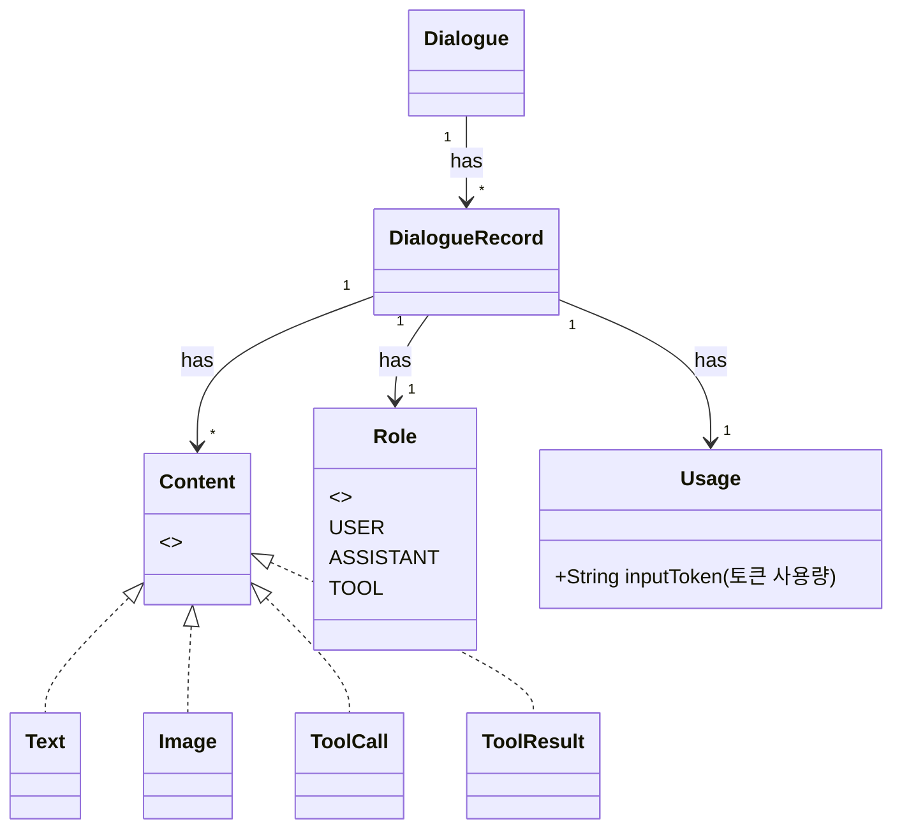

안녕하세요. AI에이전트플랫폼 베니, 클룽, 홀든 입니다.

최근 AI는 놀라울 만큼 자연스러운 대화를 만들어내고 있습니다. 상황을 정확히 파악하고 문맥에 맞는 표현을 선택하며, 때로는 재치 있는 농담까지 해내죠.

하지만 카카오는 이보다 더 깊은 AI의 가능성을 바라보고 있습니다. 단순히 말을 능숙하게 하는 수준을 넘어서 **사용자의 요청을 정확히 이해하고 그에 맞는 행동까지 수행할 수 있는 AI가 필요해진 시점**이라고 생각합니다.

예를 들어, "오늘 3시에 무슨 회의가 있어?"라는 질문에 단순히 답변을 생성하는 것만으로는 부족합니다. 사용자가 원하는 것은 AI가 직접 캘린더를 열어 실제 일정을 확인한 후에 그 정보를 전달해주는 것입니다.

즉, 상황을 이해하는 것을 넘어 직접 도구를 활용해 적절한 액션을 수행할 수 있는 AI가 카카오가 그리는 다음 단계입니다.

이처럼 '도구를 사용할 줄 아는 AI’는 최근 AI 기술의 핵심 화두로 떠오르고 있으며, AI에 도구를 연결하는 방식을 표준화하고 확장하는 프로토콜이 바로 **MCP** (**Model Context Protocol**)입니다.

저희는 이 MCP를 실험하고 실제 서비스에 적용해보기 위한 플랫폼을 만들었고, 그것이 바로 PlayMCP입니다. **PlayMCP**는 AI가 도구를 사용할 수 있도록 연결해주고, 또 AI의 도구 활용을 테스트할 수 있는 공간입니다. 우리는 이 공간에서 도구 기반 AI가 일상 속에 자연스럽게 스며드는 미래를 먼저 그려보려고 합니다.

이번 글에서는 PlayMCP의 기술적 배경과 해결하고자 하는 문제가 무엇인지, 또 이 플랫폼을 어떻게 만들어왔는지 자세히 소개해드리겠습니다.

## 1. PlayMCP, 이것 뭐에요?

PlayMCP는 2025년 7월 31일 오픈한 신선하고☘️ 따끈따끈한☀️ 서비스로, 카카오 AI 서비스에 연결될 MCP 서버를 실험하고 준비할 수 있는 개발자용 플랫폼입니다. 👉🏻 [PlayMCP 바로가기](https://playmcp.kakao.com/)

PlayMCP에서는 LLM과 연결되는 다양한 도구를 직접 테스트할 수 있습니다.

AI가 실제로 어떤 도구를 호출하고, 그 과정에서 어떤 데이터를 주고받는지 투명하게 확인하며 실험하는 플레이그라운드 역할을 합니다.

아울러, 자신이 만든 도구를 다른 사람들과 공유하거나 다른 사용자가 만든 도구를 직접 사용해 볼 수 있는 마켓으로서의 기능도 제공합니다.

### PlayMCP에서 할 수 있는 일 👀

#### 1. MCP 서버 탐색

* 카카오 내부 서비스 뿐만 아니라 다양한 개발자와 개발사가 공개한 MCP 서버를 탐색할 수 있습니다.

* 현재는 카카오 서비스와 관련된 MCP 서버가 주로 공개되어 있지만, 앞으로 더 다양한 MCP 서버가 공개될 예정입니다.

* 마음에 드는 MCP 서버는 바로 AI 채팅에 적용해 사용해볼 수 있어요!


#### 2. AI 채팅 테스트

* 선택한 MCP 서버를 AI 채팅에 적용하면 대화 흐름에 따라 어떤 상황에서 Tool Selection이 일어나는지 확인할 수 있습니다.

* Tool Argument Binding 과정을 툴 호출 로그 뷰어를 통해 시각적으로 확인할 수 있어, 도구 호출의 흐름을 보다 쉽게 이해할 수 있습니다.


#### 3. MCP 서버 등록

* 내가 직접 만든 Remote MCP 서버를 PlayMCP에 등록할 수 있습니다.

* 처음에는 임시 등록 상태로 조용히 테스트해볼 수도 있고, 원한다면 다른 사용자에게 공개해 사용성과 반응을 확인할 수도 있어요.


> 💡 참고: PlayMCP는 현재 베타 서비스로, 사용자 피드백을 반영해 지속적으로 개선해나가고 있습니다.

PlayMCP에 대한 기본적인 소개는 여기까지입니다. 이제부터는 이 플랫폼이 어떻게 만들어졌는지 자세히 이야기해보겠습니다.

## 2. PlayMCP의 핵심, MCP의 등장 배경

### USB 포트가 없는 컴퓨터: MCP 이전의 LLM 생태계

MCP는 (위에서 잠깐 언급했지만) 대규모 언어 모델(LLM)이 외부 도구 및 컨텍스트와 원활하게 상호작용할 수 있도록 만들어진 프로토콜입니다.

그런데 이 정의만 봐서는 MCP가 왜 이렇게 큰 주목을 받는지 의문이 들 수 있습니다.

MCP 이전에도 LLM은 이미 웹 검색을 하거나 코드를 작성하는 등 에이전틱(Agentic)한 AI로서 충분히 다양한 역할을 해왔기 때문이죠.

MCP가 주목받는 핵심적인 이유는 바로, **LLM과 외부 도구가 연결되는 통일된 규격을 제시**했기 때문입니다.

MCP 등장 이전의 개발자는 자신이 개발한 도구를 여러 LLM에 연결하기 위해서 **모델마다 다른 연동 방식에 맞춰 직접 연동 작업**을 해야만 했습니다.

이는 마치 모든 컴퓨터가 **USB 포트 대신 독자 규격 포트만 지원**해서, 사용자가 가지고 있는 주변 기기를 자유롭게 연결하기 어려운 것과 같은 상황이었죠.

LLM 서비스 제공자 입장에서도 문제는 컸습니다.

도구를 활용하는 LLM 서비스를 제공하기 위해서는 직접 외부 도구를 붙여야 했는데, 사용자가 필요로 하는 모든 도구를 연결하는 것은 사실상 불가능한 일이었습니다. 결국 서비스 제공자는 제한된 범위의 도구만 지원할 수밖에 없었고, 이는 **서비스 확장에 큰 제약**이 되었습니다.

결국 표준의 부재는 AI 생태계의 **생산성과 확장성에 구조적인 한계** 를 만들어냈습니다. 그리고 바로 이 한계를 해결하기 위해, **MCP라는** ‘**게임 체인저** ’**가 등장했습니다**.

### MCP: AI 세상의 USB-C 표준

MCP는 LLM과 외부 도구를 연결하는 보편화 된 공통 인터페이스, 즉 **AI 세계의 USB-C 표준**을 지향하는 프로토콜입니다.

MCP 표준을 지원하는 LLM 서비스와 외부 도구는 마치 USB 케이블을 꽂으면 바로 연결되는 것 처럼 별도의 복잡한 통합 과정 없이 연결될 수 있습니다.

이제 LLM은 MCP라는 표준화된 포트 규격을 통해 누구나 필요한 도구를 자유롭게 연결할 수 있는 **확장 가능한 시스템**으로 진화했습니다. 코딩을 전혀 모르는 일반 사용자도, LLM 서비스가 MCP를 지원하기만 한다면(ex. Claude) 원하는 MCP 서버를 손쉽게 연결할 수 있죠.

**PlayMCP** 역시 MCP의 핵심 스펙을 충실히 지원합니다. 직접 구현한 MCP 서버를 등록해 동작을 검증할 수 있고, 다른 사람이 올린 MCP 서버를 AI 채팅에 적용해 보며 새로운 활용 아이디어를 얻을 수 있습니다.

그럼 이제부터 **PlayMCP가 MCP 스펙을 어떻게 구현하고 있는지** 자세히 살펴보겠습니다.

## 3. PlayMCP가 MCP 스펙을 구현한 방식

### 시작하기에 앞서

이 글은 MCP 스펙에 대한 기본적인 이해가 있다는 것을 전제로 작성되었습니다.

만약 MCP 스펙에 대한 학습이 필요하시다면 [MCP Documentation](https://modelcontextprotocol.io/docs/getting-started/intro)을 참고해 주세요.
> 💡 **참고: MCP 학습에 AI 활용하기**
>
>
> MCP 스펙은 최근에도 계속 바뀌고 있기 때문에, AI에게 아무런 맥락 없이 MCP에 대해 질문하면 잘못된 답변이 나올 수 있습니다.
>
>
> [MCP Documentation](https://modelcontextprotocol.io/docs/getting-started/intro) 페이지 상단에는 페이지 내용을 한 번에 복사할 수 있는 기능이 제공되는데요. 해당 기능을 활용해 AI에게 페이지 내용을 컨텍스트로 제공한 뒤, “이 내용을 기반으로 설명해 달라”고 질문하시면 할루시네이션을 피할 수 있습니다.
>
>
> 필자는 MCP 학습 과정에서 [NotebookLM](https://notebooklm.google.com/) 을 유용하게 활용했으니 (학습할 내용에 대한 컨텍스트가 명확하게 주어지는 경우 아주 강력한 도구가 됩니다) 여러분도 한 번 사용해보세요!

### MCP 아키텍쳐의 핵심 구성 요소: Host, Client, Server


MCP는 기본적으로 Client-Server 구조를 따르며, 크게 [세 가지 컴포넌트](https://modelcontextprotocol.io/docs/learn/architecture#participants)로 구성됩니다:

* **MCP Host**: Claude Code, Claude Desktop 등의 AI 애플리케이션으로, 여러 MCP 클라이언트를 관리하고 조율하는 역할을 합니다.
* **MCP Client**: 각 MCP 서버와 일대일 연결을 유지하며, 서버로부터 컨텍스트를 받아 호스트가 활용할 수 있도록 전달합니다.
* **MCP Server**: MCP 클라이언트에게 필요한 컨텍스트(데이터, 기능 등)를 제공하는 프로그램입니다. 로컬에서 실행되는 프로세스일 수도 있고, 네트워크를 통해 통신하는 원격 서버일 수도 있습니다.

### PlayMCP 아키텍쳐 = Host + Client + ⍺

PlayMCP 서비스 역시 **MCP Host와 MCP Client를 구현**하여, 사용자가 MCP 서버를 직접 연결하고 테스트할 수 있는 기능을 제공합니다.

하지만 PlayMCP는 여기서 그치지 않고, 사용자가 **다양한 MCP 서버를 탐색하고 채팅에 적용해 볼 수 있는 마켓의 역할** 도 수행하고 있습니다. 이를 위해 PlayMCP는 **MCP 서버와의 연결에 필요한 정보** (**엔드포인트, 인증 방식 등** ) 뿐만 아니라 MCP 서버 탐색을 위해 **사용자들에게 보여줄 메타데이터** (**설명, 툴 정보 등**)를 관리하고 있습니다.

또 일부 MCP 서버는 사용자의 인증 정보를 요구하는데요. PlayMCP는 사용자로부터 인증형 MCP 서버 연결에 필요한 인증 정보를 안전하게 입력 받는 **인증 플로우를 제공** 하고, MCP 서버에 연결할 때 저장하고 있던 **인증 정보를 MCP 호스트로 전달**하는 역할을 수행합니다.

다음의 다이어그램은 PlayMCP가 이러한 기능들을 어떻게 제공하는지 개념적으로 보여줍니다.


> 💡 참고: 독자분들의 원활한 이해를 위해 핵심적인 개념만 추려 간결하게 표현한 그림입니다. 실제 구조와는 조금 차이가 있으니 참고 바랍니다.

이 다이어그램에서 **MCP Server Registry** 가 MCP 서버 마켓의 기능(탐색, 등록 등)을 담당하고, **MCP Host** 컴포넌트는 위에서 설명했던 MCP 호스트로서의 기능(AI 채팅, MCP Client 관리 등)을 수행합니다. 그리고 **User-MCP Server Bindings** 컴포넌트에 사용자가 AI 채팅에 적용한 MCP 서버 목록, MCP 서버에 대한 사용자 인증 정보 등이 저장됩니다.

위 구조에 대한 이해를 돕기 위해 예시를 들어보겠습니다.

사용자가 PlayMCP에서 **MCP 서버를 탐색할 때 MCP Server Registry를 조회** 하게 됩니다. MCP 서버 탐색 중 마음에 드는 서버를 발견한 사용자는 AI 채팅에 적용합니다. 이 때 적용 여부가 **User-MCP Server Bindings 컴포넌트에 기록** 됩니다. 만약 해당 서버가 인증을 요구하는 서버라면 사용자는 인증 정보를 입력하게 되고, **이 정보도 함께 저장**됩니다.

이후 사용자가 AI 채팅에 프롬프트를 입력하면, PlayMCP는 입력된 프롬프트와 함께 **MCP Server Registry에 저장된 서버 연결 정보** (**엔드포인트, 인증 방식 등** )**와 User-MCP Server Bindings에 저장된 사용자 인증 정보를 MCP Host 컴포넌트로 전달**합니다.

**MCP Host**는 이 정보를 기반으로 MCP 클라이언트를 통해 MCP 서버와 연결하고, 연결된 MCP 서버가 제공하는 도구들을 LLM이 활용할 수 있도록 합니다.

이처럼 PlayMCP는 MCP 호스트 기능과 MCP 서버 마켓 기능을 서로 다른 컴포넌트로 분리하여 설계함으로써, 각 컴포넌트의 책임을 단순화하고, 확장과 개선에 열려있는 코드를 작성할 수 있게 되었습니다.

### PlayMCP Transport: Streamable HTTP

PlayMCP는 **Streamable HTTP** 를 기반으로 **원격 MCP 서버** (**Remote MCP Server**)를 등록하고 사용할 수 있도록 구현됐습니다.

MCP에 관심있는 분들에게 [STDIO Transport](https://modelcontextprotocol.io/specification/2025-06-18/basic/transports#stdio)가 조금 더 친숙할 수 있습니다. STDIO는 MCP 서버와 MCP 클라이언트가 동일한 머신에서 로컬 프로세스로 실행되며 표준 입출력 스트림(stdin, stdout)을 통해 데이터를 주고 받는 방식입니다.

PlayMCP는 단순한 MCP 서버 플레이그라운드를 넘어, **카카오 AI 서비스에 실제로 연결 가능한 MCP 서버를 발굴하고자 하는 목표** 가 있습니다. 따라서 추후 PlayMCP 의 MCP 서버를 카카오 AI 서비스에 통합하기 용이하도록 **원격 MCP 서버만을 지원합니다.**

MCP는 MCP 서버와의 원격 연결을 지원하기 위해 HTTP 기반의 [Streamable HTTP Transport](https://modelcontextprotocol.io/specification/2025-06-18/basic/transports#streamable-http)를 표준으로 제시합니다. Streamable HTTP는 단일 HTTP 요청/응답을 기본으로 하면서도, 필요에 따라 SSE를 옵션으로 제공하고 있습니다. HTTP 기반 표준 인증 방식(bearer token, API keys, custom header 등)을 지원한다는 장점도 있습니다.

### Stateful, long-lived Connection?

MCP는 Stateful 프로토콜로 설계되었습니다. 로컬 데스크톱 애플리케이션 환경에서 서버-클라이언트 간에 long-lived connection 을 유지한 상태에서 RPC 호출을 주고 받는 모델이 자연스러웠습니다. Streamable HTTP 이전에 원격 MCP 서버와의 통신 방식으로 제공되었던 [HTTP + SSE](https://modelcontextprotocol.io/specification/2024-11-05/basic/transports#http-with-sse) 스펙 역시 long-lived connection 기반입니다.

Statefulness는 Remote MCP 환경에서도 몇 가지 장점이 있습니다.

* Notification, Sampling 처럼 Server Initiated Messages 를 보낼 수 있습니다. 예를 들어, 툴 목록이 바꼈을 때 MCP 서버에서 호스트로 알림을 줄 수 있습니다.

* 연결이 끊기더라도 세션 정보를 활용해 스트림을 재개할 수 있습니다.

하지만 Remote 환경이기에 발생하는 단점들이 있습니다.

* Long-Lived Connection 은 Scaling 이 어렵습니다

* Serverless 배포에 적합하지 않습니다.

* Connection 이 특정 서버에 종속되므로 분산 환경에서 다수의 서버 인스턴스를 운영할 경우 재연결 시 동일 인스턴스로 라우팅하지 않으면 세션이 무효화됩니다.

* 무엇보다 MCP의 중요한 철학 중 하나는 서버 구현을 단순하게 유지하는 것인데, Stateful 서버는 복잡도가 높습니다.


이러한 trade-off 때문에 Streamable HTTP 는 Stateless(HTTP POST) 를 기본으로 하되, Stateful(SSE) 은 옵션으로 제공하는 절충안을 채택했습니다.

PlayMCP 의 AI 채팅에서도 MCP 호스트/클라이언트로서 Stateful 옵션(SSE)을 지원합니다. 하지만 등록될 대부분의 MCP 서버는 Stateless 하게 동작할 것으로 예상합니다. 샘플링과 같이 Stateful 특성이 필요한 기능도 현재는 제공하지 않습니다.

MCP는 본래 Stateful 한 데스크탑 어플리케이션 환경을 전제로 설계되었기 때문에, 분산 웹 환경에서 MCP Host를 운영할 때 자연스럽지 않은 부분이 있습니다. 대표적으로 모든 Operation을 시작하기 전에 Initialization Phase를 반드시 거쳐야 한다는 제약이 있습니다. 일반적인 REST API라면 불필요한 과정이었을 것입니다. 서버 세션 정보를 Host가 보관해 초기화를 건너뛰는 방법도 있을 수 있지만, 분산 환경에서 세션을 관리하는 것은 확장성과 안정성 측면에서 부담이 됩니다.

이처럼 MCP 를 Remote 환경에서 사용하는 것은 초기 프로토콜의 설계 철학과 일부 충돌하는 면이 있습니다. 커뮤니티도 이를 인지하고 있으며, [Streamable HTTP를 제안했듯](https://github.com/modelcontextprotocol/modelcontextprotocol/discussions/102) 지속적인 논의와 개선이 이루어지고 있습니다. 따라서 MCP를 활용해 개발하는 입장이라면 이러한 배경을 이해하고 변화를 주시하는 것이 도움이 될 것입니다.

### PlayMCP와 인증

지금까지 PlayMCP가 MCP 서버와 어떻게 연결되는지 살펴봤습니다.

이제는 MCP 서버와의 연결에서 빼놓을 수 없는 또 하나의 중요한 키워드, 인증에 대해 이야기해 보겠습니다.

MCP 서버가 단순히 정적인 리소스를 제공하는 것을 넘어, 사용자별로 개인화된, 혹은 보호받는 리소스를 제공하려면 반드시 **인증을 수행할 수 있어야 합니다.**

MCP 역시 이러한 필요성을 반영해 인증 스펙을 정의하고 있습니다. 특히 Streamable HTTP 통신 방식에서는 **HTTP 표준 인증 방식을 지원** 하며, 그 중 **OAuth 기반 인증**을 통해 인증 토큰을 발급받아 인증하는 방식을 권장하고 있죠.

PlayMCP 역시 MCP 스펙을 충실히 따르면서, 개발자와 사용자가 더 쉽게 MCP 서버를 연동할 수 있도록 인증 방식을 두 가지 형태로 추상화하여 제공합니다.

바로 커스텀 헤더 기반의 **Key/Token 인증 방식** 과, **OAuth 인증 방식**입니다.

지금부터 각 인증 방식에 대해 알아보며, PlayMCP가 MCP의 인증 스펙을 어떻게 구현했는지, 그리고 그 과정에서 어떤 시행착오가 있었는지 이야기해보려 합니다.

#### Key/Token 인증 (Custom Header 인증)


PlayMCP의 Key/Token 인증은 일반적으로 **커스텀 헤더** (**Custom Header** ) **인증** 이라 불리는 인증 방식으로, **MCP 클라이언트가 MCP 서버가 정의한 커스텀 HTTP 헤더를 통해 인증 키나 토큰을 전달하는 방식**을 의미합니다. 해당 방식은 인증 로직 구현이 상대적으로 쉽기 때문에, 많은 MCP 서버가 커스텀 헤더 방식으로 인증을 수행하고 있습니다.

PlayMCP가 Key/Token 인증 방식을 지원하는 이유 역시 이러한 상황을 반영했기 때문입니다.

PlayMCP에 Key/Token 인증 방식을 사용하는 MCP 서버를 등록하기 위해, 개발자는 인증에 사용할 커스텀 헤더의 이름과 이에 대한 설명을 함께 입력해야 합니다.

#### OAuth 인증

OAuth 2.0 표준에서는 OAuth 인증 플로우에 필요한 [네 가지 역할(Role)](https://datatracker.ietf.org/doc/html/rfc6749#section-1.1)을 정의합니다:

* **Resource Owner(RO)**: 보호된 리소스 접근 권한을 가진 주체 (일반적으로 최종 사용자)

* **Resource Server(RS)**: Access Token을 사용해 요청을 검증하고 리소스를 반환하는 서버

* **Client**: Resource owner의 승인을 받아, 대신 Resource server에 리소스를 요청하는 애플리케이션

* **Authorization Server(AS)**: Resource owner를 인증하고, 인증에 성공하면 client에 access token을 발급하는 서버

> 💡 참고: Client, Authorization Server 등의 용어는 기술 문서에서 범용적으로 쓰일 수 있는 단어이기 때문에 문맥에 따라 다른 의미로 받아들여질 수 있습니다. 따라서 이 단락에서는 OAuth 기술 용어임을 명확히 하기 위해 영어 원문 그대로 사용합니다.

PlayMCP에서는 이 역할들이 다음과 같이 매핑됩니다.

* Resource Owner: PlayMCP 사용자

* Resource Server: 연결 대상이 되는 MCP 서버

* Client: PlayMCP 서비스

* Authorization Server: MCP 서버별로 연동된 외부 인증 서버

PlayMCP는 사용자(RO)의 인증 정보를 저장 및 관리하고, MCP 서버(RS)와 연결할 때는 저장된 인증 정보를 MCP 서버에 전달해야 합니다. 이 역할은 OAuth 2.0에서 정의된 네 가지 역할 중 Client가 수행하는 것과 정확히 일치하기 때문에, PlayMCP가 **Client** 역할을 수행하게 된 거죠.

Client는 OAuth 인증 플로우에서 Access Token을 발급받는 역할도 수행합니다. 이를 위해서는 먼저 **Authorization Server에 Client 등록** 과정을 거쳐야 합니다.

하지만 PlayMCP가 MCP 서버 제공자를 대신해 Authorization Server에 직접 Client 등록을 하는 것은 현실적으로 불가능합니다. 따라서 MCP 서버 제공자는 서버 등록 전 미리 Authorization Server에 Client를 등록해야합니다. 그리고 MCP 서버 등록 과정에서 Authorization Server에 등록한 Client의 정보 - Client ID, Client Secret, Authorize Endpoint, Token Endpoint, Scope, Grant Type - 를 입력해서 PlayMCP에 해당 정보들을 전달해야 하죠.

PlayMCP는 이 정보들을 통해 해당 Client의 역할을 대행할 수 있게 됩니다.

다음은 PlayMCP가 제공하는 OAuth 인증 플로우를 설명하는 다이어그램입니다 (현재 PlayMCP는 Authorization Code Grant Type만 지원하고 있어서 해당 Grant Type 기준으로 설명된 그림입니다).

```mermaid
sequenceDiagram
    autonumber
    actor U as User (RO)
    participant B as Browser
    participant C as PlayMCP (Client)
    participant AS as Authorize Server
    
    note over U,AS: OAuth 인증 MCP 서버를 AI 채팅에 적용
    note over B: OAuth 인증 유도 팝업 렌더링
		U->>B: OAuth 인증 유도 팝업 확인 버튼 클릭

    B->>C: MCP 서버(RS)에 연결된 Authorize Server의 authorization endpoint 요청 
    C->>C: code_verifier 생성 및 저장
code_challenge, state 생성
    C-->>B: 302 Redirect to authorization endpoint 
 (쿼리 파라미터: client_id, redirect_uri, response_type, code_challenge, code_challange_method, state)

    B->>AS: Redirect to authorization endpoint (쿼리 파라미터 포함)
    AS-->>B: 로그인 폼 화면 HTML
    B-->>U: 로그인 폼 화면 렌더링

    U->>B: ID/Password 입력
    B->>AS: 로그인 요청 (사용자 인증 정보 전달)
    AS->>AS: 사용자 인증 성공
    AS-->>B: 권한 설정(Scopes 설정) 및 사용자 동의 화면 HTML
		B-->>U: 권한 설정(Scopes 설정) 및 사용자 동의 화면 렌더링
    
    U->>B: 권한 설정 및 동의 버튼 클릭
    B->>AS: 사용자가 설정한 권한 및 동의 여부 전달
    AS-->>B: 302 Redirect to redirect_uri 
 (쿼리 파라미터: code, state)
    B->>C: Redirect to redirect_uri (쿼리 파라미터 포함)

		C->>C: 인증 대상 MCP 서버의 인증 설정 정보 조회 
 (client_id, client_secret, token endpoint, ...) 
		C->>C: 사용자의 code_verifier 조회
    C->>AS: Token endpoint로 토큰 발급 요청 
 (with code, client_id, client_secret, code_verifier, ...)
    AS-->>C: access_token, refresh_token, expires_in, token_type, ...

    C->>C: access_token을 포함한 사용자 인증 정보 저장

    C-->>B: OAuth 인증 요청을 시작했던 화면으로 302 Redirect 
    B->>C: Redirect
    C-->>B: 인증 요청 시작했던 화면 HTML
    B-->>U: 인증 요청 시작했던 화면 렌더링
```

\< PlayMCP OAuth 인증 플로우 \>

위 다이어그램을 보면 PlayMCP가 어떤 흐름으로 OAuth Client 역할을 수행하는지 확인할 수 있는데요. PlayMCP가 OAuth 인증 과정에서 발생할 수 있는 보안 위협을 줄이기 위해, MCP 스펙에도 명시되어 있는 [PKCE](https://datatracker.ietf.org/doc/html/rfc7636)를 지원하고 있다는 점(code_verifier, code_challange 관련 내용)도 잘 드러나 있습니다.

## 4. PlayMCP Lifecycle

MCP는 MCP 클라이언트, 서버간 [Lifecycle](https://modelcontextprotocol.io/specification/2025-06-18/basic/lifecycle) 을 정의하고 있습니다. PlayMCP 의 경우 AI Application이자 MCP 서버의 Registry로서 더 확장된 Lifecycle을 가지고 있습니다.

### MCP Registry


PlayMCP는 MCP Registry로서 MCP 서버들을 등록하고 그 정보를 적절히 취합해 유저에게 노출합니다. Remote MCP 서버들과 Operation을 통해 필요한 정보들을 수집합니다.

* PlayMCP에 등록해둔 정보들을 조회합니다.

* MCP [Initialization Phase](https://modelcontextprotocol.io/specification/2025-06-18/basic/lifecycle#initialization)를 거쳐서 ProtocolVersion, Capabilities, ServerInfo 등을 조회합니다.

* MCP [Listing Tools](https://modelcontextprotocol.io/specification/2025-06-18/server/tools#listing-tools) Operation을 거쳐서 tool 정보를 조회합니다.

```mermaid
sequenceDiagram
    actor C as User
    participant P as PlayMCP
    participant RMS as Remote MCP Servers

	C->>P: 보관 중인 MCP 서버 정보 요청

	P->>P: 유저 MCP 서버 스토리지에서 조회

	par for each MCP Server (in parallel)
	    Note over P,RMS: MCP Initialization Phase
	    P->>+RMS: POST initialize
	    RMS-->>-P: InitializeResult(protocolVersion, capabilities, serverInfo)
	    P--)RMS: initialized notification
	    P->>P: MCP Session established

	    opt tool 정보가 필요하다면
		    Note over P,RMS: MCP Operation Phase
(Listing Tools)
			P->>+RMS: POST /tools/list
			RMS-->>-P: ListToolsResult(..., Tools[])
	    end
    end

	P-->>C: MCP 서버 정보 응답
```

\< MCP Registry 조회 시퀀스 다이어그램 \>

### AI Chat

PlayMCP는 ChatGPT, Claude Desktop 과 같은 AI Application 입니다. MCP 서버를 활용해 AI 채팅 기능을 제공하고 있습니다. 전체적인 구조를 설명하기에 앞서, AI 채팅을 구성하는 주요 개념들을 먼저 살펴보겠습니다. 저희는 유저와 AI 간의 상호작용을 추적하기 위해 대화 기록을 영속화하며, 이를 바탕으로 프롬프트를 누적하고 있습니다.

**Dialogue**라는 엔티티를 통해 대화 기록을 관리합니다.

* **Content**: 대화의 실제 내용(예: 텍스트 메시지, 이미지 등)을 의미합니다.

* **Role**: 대화의 주체(예: User, Assistant, System 등)를 의미합니다.



\< Dialogue 데이터 모델 \>

아래 예시를 통해 간단히 살펴보겠습니다.

유저가 `"오늘 날씨 어때?"`라고 물어본다면, 이는 `Dialogue(content="오늘 날씨 어때?", role=USER)` 형태로 저장됩니다. 중앙의 Agent 서버가 User Query를 AI Model에 전달하면 AI Model 은 User Query 를 바탕으로 아래와 같은 ToolCall 정보를 돌려줍니다.

1. Tool 을 사용해야 하는지 여부와 어떤 Tool 을 사용할지 판단(Tool Selection),
2. Tool 을 사용한다면 User query를 기반으로 어떤 인자를 넣을지 결정(Argument Binding)

위 과정의 결과로 특정 날짜의 날씨를 조회하기 위해 Weather API 를 사용하는 `GetWeatherTool` 이 `date="2025-08-25”` 인자로 선택됐다고 가정합시다.

```kotlin
class GetWeatherTool {
	...
	fun invoke(date: String) {
		val response = httpClient.getWeather(date)
		...
		return ToolResult(Encoder.encode(response).textContent())
	}
}
```

Weather API를 호출한 결과(ToolResult)는 `Dialogue(content=..., role=TOOL)`로 문맥에 추가됩니다. 이후 AI Model은 이 Tool Result 를 바탕으로 유저 응답을 생성하며, 이는 `Dialogue(content=..., role=ASSISTANT)`로 문맥에 저장됩니다. 최종적으로 유저에게 응답이 전달됩니다.

이러한 과정의 중심에는 각 요청을 처리하고 문맥을 관리하는 Agent(PlayMCP)가 있습니다. Agent는 사용자 요청을 받고, AI Model 호출과 Tool 실행을 반복하면서 응답을 만들어냅니다.

일련의 순환 과정을 이 글에서는 **Agent Loop** 라고 부르겠습니다.

```mermaid
sequenceDiagram
    actor U as User
    participant A as Agent (PlayMCP)
    participant L as AI Model
    participant T as GetWeatherTool (MCP Server)

    U->>A: "오늘 날씨 어때?"
    A->>A: append Dialogue(content="오늘 날씨 어때?", role=USER)
		A->>L: SSE connection open
		A->>L: Invoke AI with context (Dialogues)

	loop 유저에게 전달할 최종 응답을 만들때까지 반복됩니다
	    alt AI Model이 Tool Call이 필요하다고 판단했다면
	        Note over L: Tool Selection
Argument Binding
	        L-->>A: ToolCall(name="GetWeatherTool", args={ date:"2025-08-25" })
	        A->>T: invoke(date="2025-08-25")
	        T-->>A: 200 OK (weather data)
	        A->>A: append Dialogue(content=encodedWeather, role=TOOL)

	        A->>L: Invoke AI with ToolResult(content=encodedWeather)
	        L-->>A: AssistantMessage(content=modelAnswer)
	        A->>A: append Dialogue(content=modelAnswer, role=ASSISTANT)
	    else Tool이 불필요하다면
	        L-->>A: AssistantMessage(content=modelAnswer)
	        A->>A: append Dialogue(content=modelAnswer, role=ASSISTANT)
    end
    A-->>U: "{weather data} 를 AI가 해석한 결과}"
    end
```

\< Agent Loop 시퀀스 다이어그램 \>

### AI Chat with MCP

이제 PlayMCP 채팅의 전체적인 플로우를 살펴보겠습니다. 클라이언트가 대화를 시작하면 다음과 같은 절차가 수행됩니다.

```mermaid
sequenceDiagram
    actor C as User
    participant P as PlayMCP
    participant RMS as Remote MCP Servers
    participant LLM as AI Model

	C->>+P: user query: "오늘 날씨 어때?"
	P->>P: append Dialogue(content="오늘 날씨 어때?", role=USER)
	P->>P: 유저 채팅에 매핑되어 있는 MCP 서버 리스트 조회
	deactivate P

	par for each MCP Server (in parallel)
		Note over P,RMS: MCP Initialization Phase
(과정 생략)
		P->>P: MCP Session 생성
		Note over P,RMS: MCP Operation Phase
(Listing Tools)
		P->>+RMS: POST /tools/list
		RMS-->>-P: 200 OK (ListToolsResult(..., Tools[]))
	end
	P->>P: Tool 정보가 조합된 Dialogue Session 생성
```

새로운 Dialogue를 생성하고 사용자 쿼리를 기록합니다. 이 Dialogue는 이후 대화 내용 조회나 프롬프트 구성에 활용됩니다. 이어서 지정된 MCP 서버들과 Initialization 단계를 수행하여 논리적 세션들을 만들고, 이를 묶어 하나의 Dialogue 세션을 구성합니다.

Dialogue 세션은 MCP 정보와 Tool 정보의 조합으로, 한 번의 Agent Loop 동안 사용되는 논리적 세션을 의미합니다. 이후 AI 모델과 SSE 커넥션을 연결하고, 누적된 Dialogue를 프롬프트로 변환해 전달합니다.

```mermaid
sequenceDiagram
    actor C as User
    participant P as PlayMCP
    participant RMS as Remote MCP Servers
    participant LLM as AI Model

	P->>+LLM: Invoke AI with context (Dialogues)
	LLM-->>P: 200 OK (open SSE connection)
	note over P,LLM: 응답은 delta 이벤트로 스트리밍됨
	loop 유저에게 전달할 최종 응답을 만들때까지 반복됩니다
	  par upstream: Agent Loop
    opt AI Model이 Tool Call이 필요하다고 판단했다면
      LLM-->>P: ToolCall(name=... args=...) List
			par for each MCP Server (in parallel)
				Note over P,RMS: MCP Operation Phase
(Calling Tools)
				P->>+RMS: POST /tools/call
				RMS-->>-P: 200 OK (CallToolResult(content=toolResult))
        P->>P: append Dialogue(content=toolResult, role=TOOL)

    		P->>+LLM: Invoke AI with ToolResult
				LLM--)P: SSE events (delta → complete)
        P->>P: append Dialogue(content=modelAnswer, role=ASSISTANT)
			end
		end
		deactivate LLM
	  and downstream (push messages to client)
		activate P
		P--)C: SSE events (delta → complete)
"오늘 날씨는 ..."
		deactivate P
	  end
	end
```

이후 Agent Loop가 수행됩니다. Tool Call이 필요한 경우, Remote MCP 서버와 통신하여 MCP Operation(Calling Tools)을 수행합니다. 툴 응답, AI 모델 결과는 `Dialogue`에 누적되어 이후 프롬프트에 반영됩니다.


PlayMCP는 AI Model과 SSE로 통신하며, 응답을 delta 단위로 수신합니다. 동시에 클라이언트와도 SSE로 연결되어 이 delta 데이터를 그대로 전달합니다. 유저는 채팅용 SSE 스트림을 통해 AI Model이 생성하는 응답을 실시간으로 확인할 수 있습니다. 또한 Agent Loop의 진행 상태를 보여주기 위해 `"Progress"`, `"ToolCall"`, `"Complete"`, `"Error"` 이벤트를 발행하여 화면에 표시합니다.

아래 Sequence Diagram은 전체 과정을 정리한 것으로, 이해를 돕기 위해 일부 과정은 단순화·추상화되어 있음을 참고하시기 바랍니다.

```mermaid
sequenceDiagram
    actor C as User
    participant P as PlayMCP
    participant RMS as Remote MCP Servers
    participant LLM as AI Model

	C->>+P: user query: "오늘 날씨 어때?"
	P->>P: append Dialogue(content="오늘 날씨 어때?", role=USER)
	P->>P: 유저 채팅에 매핑되어 있는 MCP 서버 리스트 조회
	deactivate P

	par for each MCP Server (in parallel)
		Note over P,RMS: MCP Initialization Phase
(과정 생략)
		P->>P: MCP Session 생성
		Note over P,RMS: MCP Operation Phase
(Listing Tools)
		P->>+RMS: POST /tools/list
		RMS-->>-P: 200 OK (ListToolsResult(..., Tools[]))
	end
	
	P->>P: Tool 정보가 조합된 Dialogue Session 생성
		P->>+LLM: Invoke AI with context (Dialogues)
	LLM-->>P: 200 OK (open SSE connection)
	note over P,LLM: 응답은 delta 이벤트로 스트리밍됨
	loop 유저에게 전달할 최종 응답을 만들때까지 반복됩니다
	  par upstream: Agent Loop
    opt AI Model이 Tool Call이 필요하다고 판단했다면
      LLM-->>P: ToolCall(name=... args=...) List
			par for each MCP Server (in parallel)
				Note over P,RMS: MCP Operation Phase
(Calling Tools)
				P->>+RMS: POST /tools/call
				RMS-->>-P: 200 OK (CallToolResult(content=toolResult))
        P->>P: append Dialogue(content=toolResult, role=TOOL)

    		P->>+LLM: Invoke AI with ToolResult
				LLM--)P: SSE events (delta → complete)
        P->>P: append Dialogue(content=modelAnswer, role=ASSISTANT)
			end
		end
		deactivate LLM
	  and downstream (push messages to client)
		activate P
		P--)C: SSE events (delta → complete)
"오늘 날씨는 ..."
		deactivate P
	  end
	end
```

\< AI Chat 전체 시퀀스 다이어그램 \>

## 5. MCP 서버 구현/등록 가이드

### 내가 MCP 서버 개발자가 될 수 있을 리 없잖아, 무리무리! (※ 무리가 아니었다?!)

간단한 수도 코드와 함께 MCP 서버를 어떤 식으로 구성하고 PlayMCP에서 등록, 테스트해볼 수 있는지 살펴보겠습니다.

* MCP SDK를 이용하면 쉽게 MCP 서버를 구현할 수 있습니다.

  * 단 아직 Kotlin SDK는 Streamable HTTP를 지원하지 않습니다. (2025.08.25)
* 디버깅을 위해 [MCP Inspector](https://modelcontextprotocol.io/legacy/tools/inspector)를 사용할 수 있습니다.

* 데이터 스키마는 [MCP Schema Reference](https://modelcontextprotocol.io/specification/2025-06-18/schema) 를 참고하세요.

아래는 애니메이션을 조회하는 API 예시 코드입니다.

```Kotlin
@GetMapping("/api/animations")
fun listAnimations(@RequestParam genre: String): ResponseEntity> {
	val animations = animationRepository.findAll(genre)
	
	return ResponseEntity.ok(animations.map(::toDto))
}
```

```JSON
GET /api/animations?genre=ISEKAI
HTTP/1.1 200 OK

[
  {
    "id": "98a0d8bf-1ebc-4ce5-bbef-8632b629c7ab",
    "title": "방패용사 성공담 시즌4",
    "genre": "ISEKAI",
    "releaseDate": "2025-07-09T00:00+09:00[Asia/Seoul]"
  },
  {
    "id": "8ce62a74-372c-43d4-bea9-28af41a8beb6",
    "title": "자동판매기로 다시 태어난 나는 미궁을 방랑한다 2기",
    "genre": "ISEKAI",
    "releaseDate": "2025-07-10T00:00+09:00[Asia/Seoul]"
  },
  {
    "id": "f10624e5-525e-4529-aac7-91fa1fc07d82",
    "title": "Re: 제로부터 시작하는 이세계 생활",
    "genre": "ISEKAI",
    "releaseDate": "2016-04-04T00:00+09:00[Asia/Seoul]"
  },
  {
    "id": "b8df39bf-693c-472f-a92b-4caf03ebe8c6",
    "title": "전생 현자의 이세계 라이프 ~두 번째 직업을 얻고 세계 최강이 되었습니다~",
    "genre": "ISEKAI",
    "releaseDate": "2022-04-09T00:00+09:00[Asia/Seoul]"
  },
  {
    "id": "81d95ef9-f7c9-48a1-af6d-5cb31db25323",
    "title": "전생 현자의 이세계 라이프 ~두 번째 직업을 얻고 세계 최강이 되었습니다~",
    "genre": "ISEKAI",
    "releaseDate": "2022-04-09T00:00+09:00[Asia/Seoul]"
  }
]
```

PlayMCP는 [Listing Tools](https://modelcontextprotocol.io/specification/2025-06-18/server/tools#listing-tools)(`tools/list`), [Calling Tools](https://modelcontextprotocol.io/specification/2025-06-18/server/tools#calling-tools)(`tools/call`) operation을 호출합니다. 등록되는 MCP 서버는 관련된 capabilities를 명시하고 해당 operation을 구현해야 합니다.

```Kotlin

class McpServer(  
    val capabilities: McpSchema.ServerCapabilities,
    val implementation: McpSchema.Implementation,
    private val tools: List,  
){  	
	fun connect(transport: ServerTransport): ServerSession {
	    transport.connect() // Streamable HTTP
	    return ServerSession(this, transport)
	}

	fun listTools(): McpSchema.ListTools.Result { 
		return McpSchema.ListTools.Result(tools)
	}
	
	fun callTool(params: McpSchema.CallTool.Params, session: ServerSession): McpSchema.CallTool.Result {
		return toolsByName[params.name].handle(params, session)
	}
}
```

MCP 서버에서 제공하는 Tool들은 아래처럼 구현할 수 있습니다.

* 토큰 소비량을 고려해서 Tool을 구현해야 합니다.

  * token 소비를 줄이기 위해 tool spec을 영어로 작성하는 것이 유리합니다. [참고](https://arxiv.org/abs/2305.15425)

  * 응답이 너무 큰 경우 PlayMCP가 에러로 처리할 수 있습니다.

* AI Model이 잘 이해할 수 있도록 MCP 클라이언트로 보내는 툴 응답에는 직렬화한 데이터 보다 JSON, YAML, Markdown 등 포맷팅된 문자열을 주는 것이 좋습니다. [참고](https://arxiv.org/abs/2411.10541)

* 프롬프트 작성은 아래 가이드를 참고하세요.

* [GPT-5 prompting guide](https://cookbook.openai.com/examples/gpt-5/gpt-5_prompting_guide)

* [GPT-4.1 Prompting Guide](https://cookbook.openai.com/examples/gpt4-1_prompting_guide)

```kotlin
// 애니메이션 조회 Tool
class ListAnimationTool(val animationRepository: AnimationRepository): Tool {

    fun call(params: McpSchema.CallTool.Param): McpSchema.CallTool.Result {  
        val genre = params.aguments("genre")
        val animations = animationRepository.findAll(genre)
  
        return McpSchema.CallTool.Result(content = animations.toContent())
    } 
  
    fun spec(): ToolSpec {  
        return ToolSpec(
            name = "ListAnimation",
            description = "List animations. Optionally filter by 'genre' (if omitted, returns all).",
            inputSchema = InputSchema(
                type = "object",
                properties = mapOf(
                    "genre" to mapOf(
                        "type" to "string",
                        "description" to "Genre of animation",
                        "enum" to Animation.Genre.entries.map(Animation.Genre::name)
                    )
                ),
                required = listOf()
            )  
        )  
    }  
}

// 애니메이션 추천 Tool
class RecommendAnimationTool(val animationRepository: AnimationRepository) : Tool {  

    fun call(): McpSchema.CallTool.Result {  
        val animations = animationRepository.recommend()
  
        return McpSchema.CallTool.Result(content = animations.toContent())
    }  
  
    fun spec(): ToolSpec {  
        return ToolSpec(  
            name = "RecommendAnimation",  
            description = "Recommend animations."
        )  
    }  
}
```

이제 MCP 서버의 HTTP endpoint를 외부로 노출하면 완료입니다.

```Kotlin
@PostMapping("/mcp")  
fun handleMcpRequest(@RequestBody request: String): CompletableFuture> {  
    val httpResponseSink = CompletableFuture>()  
    val transport = object : StreamableServerTransport(request, httpResponseSink) {}  
  
    CompletableFuture.runAsync {
        try {  
            mcpServer.connect(transport).use { it.handle() }
        } catch (e: Exception) {  
            transport.abort(e)  
        }  
    }  
    return httpResponseSink  
}
```

```kotlin
// 애니메이션 조회 Tool
class ListAnimationTool(val animationRepository: AnimationRepository): Tool {

    fun call(params: McpSchema.CallTool.Param): McpSchema.CallTool.Result {  
        val genre = params.aguments("genre")
        val animations = animationRepository.findAll(genre)
  
        return McpSchema.CallTool.Result(content = animations.toContent())
    } 
  
    fun spec(): ToolSpec {  
        return ToolSpec(
            name = "ListAnimation",
            description = "List animations. Optionally filter by 'genre' (if omitted, returns all).",
            inputSchema = InputSchema(
                type = "object",
                properties = mapOf(
                    "genre" to mapOf(
                        "type" to "string",
                        "description" to "Genre of animation",
                        "enum" to Animation.Genre.entries.map(Animation.Genre::name)
                    )
                ),
                required = listOf()
            )  
        )  
    }  
}

// 애니메이션 추천 Tool
class RecommendAnimationTool(val animationRepository: AnimationRepository) : Tool {  

    fun call(): McpSchema.CallTool.Result {  
        val animations = animationRepository.recommend()
  
        return McpSchema.CallTool.Result(content = animations.toContent())
    }  
  
    fun spec(): ToolSpec {  
        return ToolSpec(  
            name = "RecommendAnimation",  
            description = "Recommend animations."
        )  
    }  
}
```

### PlayMCP 등록/동작


MCP Endpoint 입력 후 "정보 불러오기"를 누르면 ListingTools Operation 결과를 바탕으로 서버 정보를 보여줍니다. 비공개로 등록하고 싶다면 “임시 등록”으로 등록해둔 뒤, 추후 심사 요청이 가능합니다.


위 화면처럼, 등록한 MCP서버를 AI 채팅에서 테스트할 수 있습니다. 테스트 시 주로 다음과 같은 부분을 확인할 수 있습니다.

* 다수의 Tool이 존재할 때 특정 프롬프트에서 특정 Tool Selection이 기대대로 되는지 확인해보세요.

* Tool 패널에서 Tool Argument Binding이 의도한대로 동작하는지 확인해보세요.

* Tool간의 병렬 실행, 순차 실행이 의도한대로 발생하는지 확인해보세요.

## 6. 마치며

지금까지 AI가 외부 도구와 소통하는 표준 프로토콜인 MCP와 이를 실험하고 현실화하기 위한 플랫폼인 PlayMCP에 대해 소개해 드렸습니다.

AI 에이전트 시대를 준비하는 카카오의 고민에서 시작된 PlayMCP는 개발자 여러분이 자신만의 도구를 자유롭게 연결하고 테스트할 수 있는 실험실이자 마켓이 되고자 합니다.

PlayMCP는 이제 막 첫발을 뗀 베타 서비스입니다. 앞으로 더 많은 개발자분들과 함께 소통하며 더 편리하고 안정적인 플랫폼으로 발전시켜 나가겠습니다. 지금 바로 PlayMCP에서 여러분의 도구를 AI와 연결하는 새로운 경험을 시작해 보세요. 많은 관심과 참여 부탁드립니다!

### 에필로그

* 베니 : (광고) PlayMCP에서 여러분만의 MCP 서버를 테스트해보거나, 다른 개발자들의 MCP 서버를 체험해보세요! 무엇보다 내가 만든 도구를 AI가 자연스럽게 사용하는 모습을 보는 재미는 직접 경험해봐야 아실 거예요 ✨

* 홀든 : AI를 실용적으로 활용하려는 시도는 앞으로 더욱 늘어날 것이고, 이에 따라 MCP 같은 프로토콜들이 더 정교해지고 확장될 것으로 보입니다. 이런 흐름을 관심있게 지켜보셔도 좋을 것 같습니다.

* 클룽 : MCP의 등장으로 인해 마우스 클릭 몇 번만 하면 나만의 AI 에이전트를 구성할 수 있게 되었습니다. 앞으로의 개발자는 한 명의 개인이 아니라 수많은 AI 에이전트를 거느린 "군단"이 될지도 모르겠네요.

[](https://playmcp.kakao.com/)

## 7. 출처

* [Model Context Protocol - Documentation](https://modelcontextprotocol.io/docs/getting-started/intro)

* [Model Context Protocol - Specification](https://modelcontextprotocol.io/specification/2025-06-18)

* [RFC 6749: The OAuth 2.0 Authorization Framework](https://datatracker.ietf.org/doc/html/rfc6749)

* [State, and long-lived vs. short-lived connections · modelcontextprotocol/modelcontextprotocol · Discussion #10](https://github.com/modelcontextprotocol/modelcontextprotocol/discussions/102)

* [\[2305.15425\] Language Model Tokenizers Introduce Unfairness Between Languages](https://arxiv.org/abs/2305.15425)

* [\[2411.10541\] Does Prompt Formatting Have Any Impact on LLM Performance?](https://arxiv.org/abs/2411.10541)

* [GPT-4.1 Prompting Guide \| OpenAI Cookbook](https://cookbook.openai.com/examples/gpt4-1_prompting_guide)

* [GPT-5 prompting guide \| OpenAI Cookbook](https://cookbook.openai.com/examples/gpt-5/gpt-5_prompting_guide)