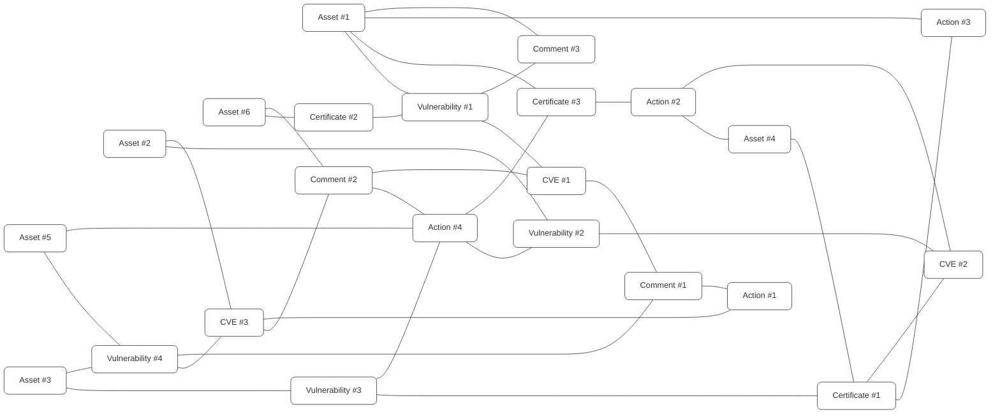
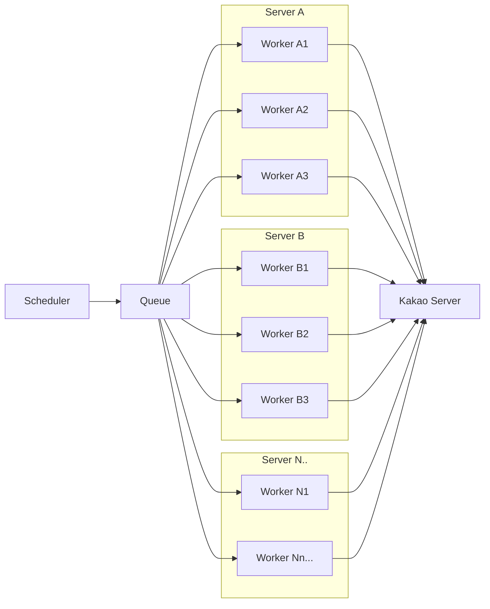

보호해야 할 대상이 있다면, 그 경계선은 언제나 공격자의 최우선 표적이 됩니다. 많은 공격자들은 웹, 네트워크 시스템 등 여러가지 표면을 탐색하며 약한 고리를 찾습니다.

우리는 이것을 공격 표면(Attack Surface)이라고 부릅니다.
> 공격 표면(Attack Surface)이란 외부에서 접근 가능한 모든 디지털 자산 — IP, 도메인·서브도메인, 오픈 포트, 웹 애플리케이션, S3 버킷, API 엔드포인트, 심지어 모바일 앱 스토어에 올라간 APK까지 — 의 집합을 말합니다. 공격자는 이 중 단 하나의 약한 고리만 찾아도 침투할 수 있습니다.

*** ** * ** ***

안녕하세요. 카카오 서비스보안 플리헤(플루토, 리나, 헤이드)입니다.

저희는 카카오에서 취약점 분석, 모의침투 등 여러가지 서비스 보안 업무를 담당하고 있으며, 서론에서 이야기한 공격 표면에 대한 관리 도구인 ASM(Attack Surface Management), YEYE를 개발하고 운영하고 있습니다.

## 카카오의 ASM 도구, YEYE

*** ** * ** ***

통상적으로 ASM은 조직이 보유한 자산을 식별·분석·관리하는 도구나 솔루션으로 불리지만, 근본적으론 이러한 활동 자체를 의미합니다. 카카오는 오래전부터 다양한 자체 도구를 통해 보안 모니터링 체계를 갖추고 있었으나, 파편화된 도구들을 통합하고 공격 표면을 체계적으로 관리하기 위해 2023년 'YEYE’^[1](#fn1)^가 탄생했습니다.

YEYE의 핵심 목표는 공격자보다 한발 앞서 공격 표면을 식별하고 제거하는 것입니다. 다양한 기능을 제공하지만, 기본적으로는 공격 표면이 될 수 있는 자산을 관리하고 가시성 좋게 보여주며, 실질적인 보안 리스크를 식별하는 기능을 가지고 있습니다. 추가로 외부 보안 이슈를 검토할 수 있는 기능도 있으며 이러한 기능들이 서로 결합되어 유기적인 결과를 얻을 수 있습니다.

* 외부 접점을 가진 자산 식별 \& 관리 (언제 추가되었는지, 담당자는 누구인지, 현재 보안 상태는 괜찮은지 등)
* 어떤 외부 이슈가 있었고 우리에게 영향을 줄 수 있는지
* 우리 자산 내 약한 부분들이 존재하는지

이를 위해서 YEYE는 내부 API, 스캐닝 등을 통해 자산 정보(IP, 도메인, 포트 등)를 수집하고 자산에 관계된 메타데이터나 보안 이슈를 식별하기 위해 주기적으로 스캐닝을 진행합니다.

## 매일 아침 시작되는 보안 리뷰, DSR

*** ** * ** ***

> Security is a process, not a product. — Bruce Schneier ^[2](#fn2)^

보안은 프로세스입니다. 저희도 YEYE를 통해서 공격 표면을 식별하지만 이를 줄여나가는 것은 사람의 몫입니다. 저희는 DSR(Daily Security Review)을 통해 이러한 점을 해소하고 있습니다.

DSR은 그룹(조)을 구성해 매일 진행하는 보안 업무로, 조별로 당번인 주 오전에는 외부 피드, 공개 취약점 등을 검토하며 여러가지 보안 활동을 진행합니다.

* 보안검수 받지 않고 오픈된 자산이 있는지?
* 공개된 취약점, 기사화된 보안 이슈 등이 카카오에 영향을 줄 수 있는지?
* 기타 여러 자산에 대한 보안 취약점, 하드닝 체크 등

YEYE에서 얻은 여러 정보, 개개인의 피드, 리서치 등을 통해 수집된 정보들은 DSR이라는 업무를 통해 보안 활동으로 이루어지고 있고, 발빠르게 외부 이슈에 대응할 수 있는 수단이 되었습니다. 그리고 점차 저희 부서 내부에서는 업무와 문화 경계에 있는 그런 무언가로 변화하고 있습니다.

## 자산을 정의하고, 연결하고, 관리하는 법

*** ** * ** ***

### 계속 확장되는 자산의 정의

초기 개발 시점부터 현재까지도 매번 고민하고 논의하게 되는 주제입니다. 공격 표면이라는 것이 넓은 의미를 가지는 대상이다 보니, 표면을 이루는 각 자산도 다양성을 가집니다. 저희는 초기에 외부에 접점이 있는 서버, 도메인, 서비스 등을 자산으로 정의했지만 점차 그 의미가 확장되어 현재는 접점이 있는 무언가, 그리고 내부에서의 접점 또한 고민하고 있습니다.

지속적으로 변화는 있지만 근본적으로는 아래와 같은 분별법을 사용하고 있습니다. 이를 통해 스캐닝이나 메타데이터 수집의 범위, 타입을 결정할 수 있고, 나아가 자산이 확장되더라도 어느 정도 일관성 있는 규칙을 가질 수 있게 됩니다.

|         구분         |       설명       |                        예시                        |
|--------------------|----------------|--------------------------------------------------|
| 범위(Scope)          | 실제 우리 자산이 맞는가? | In, Out, Undefined                               |
| 타입(Type)           | 어떤 타입의 자산인가?   | Domain, IP Address, Port, Service, Mobile App 등… |
| 식별(Identification) | 자산의 식별 여부      | Known, Unknown, 3rd Party                        |

### 다양한 소스에서 자산을 수집하는 방법

내부 API, 스캐닝 등 여러 소스에서 YEYE에 수집된 정보들은 제각각의 포맷과 정보의 성향을 가집니다. 수집한 정보를 그대로 누적하면 이를 이후에 활용하기 어렵기 때문에, 표준화하여 저장합니다. 표준화 과정은 정보를 단순화하여 근본적인 데이터를 자산으로 정의하고, 이외 데이터는 자산에 레이블을 달아주는 형태로 처리합니다.

레이블링(Labeling) 예시

|                          자산                           |  자산 타입  | 범위  |      레이블      |
|-------------------------------------------------------|---------|-----|---------------|
| 0.0.0.0                                               | IP      | out | -             |
| 0.0.0.0:80                                            | Service | out | http, apache  |
| 0.0.0.0:443                                           | Service | out | https, apache |
| [www.kakaocorp.com](http://www.kakaocorp.com)         | Domain  | in  | https         |
| [www.kakaocorp.com:443](http://www.kakaocorp.com:443) | Service | in  | https         |
| 1.1.1.1:8888                                          | Service | out | tcp           |

이렇게 정리된 자산들은 이후 관계성을 만들 때 유용하게 사용할 수 있습니다.

### 자산 간 관계가 만들어내는 힘

자산들은 각각 자산, 또 다른 여러가지 정보들과 관계성이 정의되며, 이를 통해 정보의 연관성을 통해 추적할 수 있도록 관리됩니다. YEYE에서 중요한 부분 중 하나는 자산과 여러 모델 간의 연관성입니다. 각 모델들은 다형성 구조를 가지며 서로 연관 정보를 참조할 수 있기 때문에, 아래와 같은 액션들이 가능합니다.

* 새로운 CVE(공개 취약점)이 나왔을 때 회사에 영향받는 자산이 있는지 확인
* 보안검수 받지 않은 자산이 외부로 노출되었는지 확인
* A 자산에서 식별된 취약점과 관련 부서 담당자는 누구인지 체크

그리고 자산과 이외 여러 모델들은 지속적으로 관리되는 형태의 데이터이며, 댓글 및 처리 상태 등의 이력을 관리할 수 있는 기능을 통해 추적됩니다.

## 대규모 스캔, 이렇게 최적화했다

*** ** * ** ***

YEYE는 포트 스캐닝(Port Scanning), 스크린샷 캡쳐(Screenshot Capture), 취약점 스캐닝(Vulnerability Scanning), 실시간 라이브 체크 등 다양한 유형의 스캔을 짧은 주기로 지속 수행하며 위험 요소를 선제적으로 탐지·관리하고 있습니다.

다만 스캔 대상 자산이 계속 누적되고, 대상이 많아질수록 전체 스캔 시간은 기하급수적으로 증가합니다.

이 지점에서 가장 중요한 것은 효율과 균형입니다.

* 스캔이 지나치게 오래 걸려 탐지·대응이 지연되어서는 안 되고,
* 대역폭·서버 스펙·서버 수 등 과도한 비용 투입으로 이어져서도 안 되며,
* 각 스캔 대상 시스템에 과한 부하를 주어 서비스 안정성에 영향을 주어서도 안 됩니다.

즉, YEYE는 빠르고, 비용 효율적이며, 대상에 부담이 적은 스캔 체계를 지속적으로 설계·개선하는 것이 핵심입니다.

그래서 그동안 정말 많은 시행착오를 겪었습니다.

### 네트워크 대역폭이 만든 한계

내부 물리 서버에서 스캔을 구동하던 시기에 CPU나 메모리는 여유로운데도 이상하게 스캔이 자주 지연되는 경우가 많았습니다.

처음엔 서버 성능 문제를 의심했지만, 분석해 보니 대역폭 제약 때문에 동시 요청이 몰릴 때 네트워크 지연/드롭이 발생했고, 그 결과 스캔이 늦어지거나 일부 작업이 정상적으로 끝나지 못하는 일이 반복되었습니다.

즉, 서버 자체 성능보다 네트워크 구성에서 먼저 병목이 발생하는 구조였습니다.

그래서 YEYE는 퍼블릭 클라우드(Public Cloud)를 병행하여 운영하고 있습니다.

퍼블릭 클라우드에서는 서버당 기본 제공되는 대역폭이 충분할 뿐 아니라, 필요 시 대역폭/네트워크 리소스를 유연하게 확장할 수 있어 대역폭 때문에 스캔이 지연되거나 실패하는 사례가 사실상 사라졌습니다.

덕분에 스캔 안정성과 속도 모두 눈에 띄게 개선되었습니다.

다만 사무실/물리 환경에서는 회선 증설이나 네트워크 장비 교체처럼 대역폭 확장이 쉽지 않다 보니, 이런 제약이 스캔 주기와 운영 안정성에 직접적인 영향을 줄 수밖에 없었습니다.

덕분에 병목 구간을 최소화하고 보다 안정적이고 빠른 대규모 스캔 환경을 구축할 수 있었습니다.

이유를 알 수 없는 스캔 지연이 생긴다면 네트워크 병목을 한번 의심해 보세요!

### 대규모 대상 병렬 스캔 구조

대역폭 병목을 해소한 뒤, 다음 과제는 대규모 스캔을 얼마나 빠르고 안정적으로 처리하느냐였습니다.

스캔은 기본적으로 병렬 처리가 효과적이며, 대부분의 오픈소스 스캐너도 병렬 옵션을 제공하고 있습니다.

하지만 YEYE처럼 타깃 수가 매우 큰 환경에서는 오픈소스의 단일 프로세스로는 한계가 명확했습니다.

타깃이 늘어날수록 처리 지연, 리소스 쏠림 현상이 발생했고, 결과적으로 스캔 주기를 유지하기 어려웠습니다.

그래서 저희는 대상을 단위별로 분리하고, 여러 워커/프로세스가 독립적으로 병렬 스캔할 수 있는 구조를 직접 구현했습니다.

그 결과 타깃 증가에도 안정적으로 확장할 수 있었고, 처리 속도와 운영 안정성 모두 크게 개선할 수 있었습니다.

### 가성비 기반 인프라 설계

최고 사양의 서버를 대량 투입하면 성능 문제는 빠르게 해결될 수 있겠지만, 비용은 언제나 한정되어 있습니다.

그래서 저는 '무조건 좋은 서버’가 아니라 스캔 특성에 맞는 최소 스펙과 최적의 서버 구성을 찾는 것에 집중했습니다.

여러 인프라 조건에서 반복적으로 스캔 테스트를 진행하면서,

* CPU/메모리/네트워크 중 실제 병목이 어디서 발생하는지,
* 스캔 종류별로 필요 자원이 어떻게 다른지,
* 스펙을 올렸을 때 성능 향상이 비용 대비 의미 있는 수준인지
  를 하나씩 검증했습니다.

그 결과, 단순히 스펙을 올리는 방식보다 적정 스펙의 서버를 효율적으로 분산·확장해 운영하는 구조가 속도와 비용 측면에서 가장 안정적이라는 기준을 도출했습니다.

즉, '최소 스펙으로 안정적으로, 필요할 때만 확장하는 운영 방식’이 YEYE에 가장 맞는 해답이었습니다.

### 서비스 영향 최소화를 위한 스캔 최적화

마지막으로, 서비스 안정성에 영향을 주지 않기 위해 오픈소스 스캐너와 자체 도구의 옵션을 세밀하게 조정했습니다.

실제로 스캔 트래픽이 외부 공격으로 오해되어 서비스 담당자로부터 “공격이 들어온 것 같다, 확인해 달라”는 등의 문의가 종종 있었습니다.

이런 혼선을 줄이기 위해 고정 IP와 헤더 내 UA(User-Agent) 식별 정보를 통해 YEYE 스캔 트래픽임을 사전에 인지할 수 있도록 안내하고 있습니다.

동시에 서버당 초당 호출 수, 동시성, 타임아웃, 재시도 정책 등 핵심 성능 파라미터를 지속적으로 튜닝해 속도·비용·대상 부하 간 균형점을 안정적으로 맞춰왔습니다.

고통스러운 과정이었지만, 그 결과 YEYE는 대규모 대상도 빠른 주기로 안정적으로 모니터링할 수 있는 운영 역량을 갖추게 되었습니다.

## 헤이드의 ‘판도라의 상자’

*** ** * ** ***

안녕하세요, 플리헤의 막내 헤이드입니다.

플루토, 리나가 YEYE를 만들고 키워온 지 1년쯤 됐을 때, 저는 “아, 스캔 도구 하나 더 맡으면 되겠지?” 하는 가벼운 마음으로 합류했습니다. 그리고 2024년 3월 사건이 일어났습니다…

미팅 첫날 위키를 열어보는 순간, 진짜로 입이 쩍 벌어졌습니다.
> “이게… 도대체 뭐야…?”

### 구성도 한 장이 가져온 충격

처음 구성도를 열었을 때의 충격은 아직도 잊지 못합니다. 물론 다른 팀원이 무려 1년 동안이나 개발한 서비스의 구성도를 보는 일이기에 어느 정도 이해하기 쉽지 않을 것이라는 예상은 했지만 YEYE는 제 예상을 가볍게 뛰어넘었습니다.

특히 ‘외부자’ 관점에서 스캔을 진행해야 하는 특이한 환경 때문에 카카오의 IDC 뿐만 아니라 퍼블릭 클라우드, ACL, 네트워크 관련 문제까지 얽혀 있었고, 사용자 입장에서는 보이지 않던 기능이나 코드들이 많이 존재했습니다.

그걸 본 순간 잘못된 영역에 발을 넣어 버렸다는 생각을 했고, 그때 도망쳤어야 했는데 도망칠 용기가 부족해서 남아있게 되었습니다:).

### 첫 임무

제가 YEYE에서 처음 맡은 과제는 다양한 인프라 구간에 배치된 도구들의 상태를 관리할 수 있는 시스템를 구축하는 일이었습니다. YEYE란 서비스가 다양한 인프라에 걸쳐서 운영되는 서비스이다 보니 각 구간에 퍼져있는 도구나 에이전트(Agent)들이 실제로 작업을 처리할 수 있는 상태인지 또는 살아 있는지 쉽게 볼 수 없다는 이슈가 있었습니다.

이를 해결하기 위해 서비스 디스커버리(Service Discovery) 도구를 배치하여 이를 해결하려 했고, 구축 자체는 쉬웠으나 적절한 위치에 배치하는 것이 정말 어려웠습니다. 특히 ACL은 구성도를 잘 모르는 상태에서는 이유도 모르고 실패하던 주요 원인 중 하나였습니다.

결과적으로 잘 배치했고, 이 시점을 계기로 서비스 구성에 대한 많은 부분들이 이해되기 시작했습니다. 그래서 그런지 아주 기억에 많이 남는 미션이었습니다.

### 본업이 따로 있는 조직의 현실

우리 팀은 YEYE 전담 개발팀이 아닙니다. 평소에는 취약점 분석, 레드팀, 보안검수, 이슈 대응 등 본업이 우선입니다. YEYE는 ‘틈나는 대로’ 고치는 사이드 프로젝트 수준이었습니다.

그러니까 뭔가를 수정하고 만들어야 할 타이밍에

* 보안검수 할당됨 -\> 본업해야지
* 버그바운티 인입됨 -\> 본업해야지
* 장애채팅방이 바쁘게 울림 -\> YEYE 이슈인가? 체크 필요함

그 와중에 저는 "이거 언제 다 이해하고 고치지?"라는 압박에 시달렸습니다.

### 그래도 지금은

6개월쯤 지나니까 눈에 보이기 시작하더라고요. 이제는 제게 할당된 GitHub 이슈(Issue)가 상당히 많아졌고 장애 알림이 울려도 평온한 마음으로 바라볼 수 있습니다.

처음엔 진짜 판도라의 상자였는데, 지금은 그 상자 안에 든 게, 많은 시행착오의 과정을 통해 얻게 된 지혜라는 걸 알게 됐습니다. 그리고 그 상자를 물려받은 제가 다음에 합류할 누군가에게 또 다른 판도라의 상자를 물려줄 차례겠죠?

(예냥이한테 물려주고 싶지만… 아직은 멀었어요:))

## 예냥이, YEYE의 AI 어시스턴트

*** ** * ** ***

수많은 자산, 공개된 취약점, 스캔 결과는 사람이 모두 검토하기에는 많은 양이며 이러한 상황은 중요한 정보를 놓치게 만드는 요소 중 하나입니다. 이러한 리소스 증가를 해소하기 위해 YEYE의 AI 어시스턴트(Assistant) '예냥이’가 개발되었습니다. 예냥이는 YEYE 시스템에 통합되어 동작하며 YEYE 내 여러가지 AI 기반 기능들을 처리합니다. 대표적으로 아래와 같은 일들을 주로 처리합니다.

* 개발자에게 전달되었지만 조치되지 않고 있는 이슈를 찾아 리마인드
* 신규 자산 식별 시 관련 정보를 사전에 찾음
* CVE 검토, 한글화 정리 및 요약
* DSR 그룹(조) 간 정보 전달 등

현재로서는 시스템 내 통합되어 보조되는 형태의 기능이지만 앞으로 사람과 같이 이슈를 할당받아 처리할 수 있도록 할 예정이며, 나아가서 독자적으로 보안 이슈를 계속 리서치할 수 있는 그런 어시스턴트로 개선할 예정입니다.

언젠가 대부분의 단순한 작업을 예냥이가 처리하고, 보안팀은 조금 더 가치있는 일에 집중할 수 있는 구조가 되기를 바라고 있습니다.

## 결국 ASM은 도구가 아닌 문화다

*** ** * ** ***

> 결국 진정한 ASM은 '도구가 아니라, 매일 아침 시작되는 사람들의 집요함’입니다.

도구를 만드는 것은 어렵지만, 이를 사용하고 계승해 나가며, 문화로 자리잡게 하는 것은 훨씬 어렵습니다. 저희가 수행하는 프로세스, 즉 보안 모니터링 업무인 DSR은 같이 일하는 많은 동료들의 피와 땀으로 이루어진 결과이자 문화입니다. 구성원들의 전문성과 이해, 협력 그리고 잘 갖춰진 프로세스와 이를 보조하는 도구는 궁극적으로 ASM을 달성할 수 있는 기반이라는 생각이 듭니다.

## 마치며

*** ** * ** ***

ASM은 기업의 보안성을 챙기기 위한 중요한 장치 중 하나이며, 꾸준히 빌드업이 필요한 요소라고 생각합니다. 이 글에서 작성한 내용은 YEYE와 저희 업무의 일부이지만, 이 글을 보시고 저희와 같은 고민을 하는 모든 분들에게 영감이나 도움을 드릴 수 있으면 좋겠습니다.

감사합니다.

*** ** * ** ***

1. YEYE란 이름은 카카오의 노란색, 지켜보다란 의미로 눈이란 단어를 조합하여 만들었습니다. [↩︎](#fnref1)

2. Bruce Schneier, Secrets and Lies: Digital Security in a Networked World 서문 [↩︎](#fnref2)